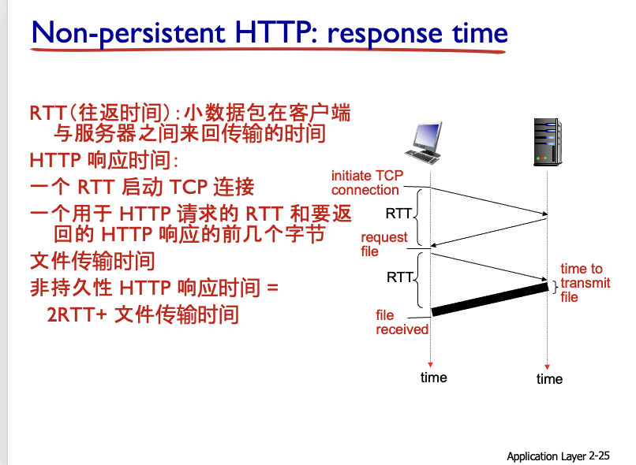

## 应用层：

DNS定义、作用、工作原理
http-https
ping、tracert、nslookup、ipconfig、arp-a（深刻理解）
文件传输p2p SMTP POP3 IMAP邮件协议 CDN

> (新加)

## 2 五个命令行工具(要考)

1. **ping**：基于 **ICMP Echo**。向目标发 Echo Request，收到 Echo Reply 说明 **IP 层到主机可达**；RTT 反映时延。丢包或 RTT 激增多为链路、路由拥塞。
2. **tracert / traceroute**：利用 **逐跳递增 TTL** 获得每跳路由器的 ICMP “Time Exceeded” 报文，从而打印路径 + 分段 RTT。判断拥塞点首选工具。
3. **nslookup / dig**：手动查询 DNS，引导回答“DNS 递归/迭代、缓存”类题目。`nslookup -type=mx gmail.com` 可看到 MX 记录。
4. **ipconfig / ifconfig**：查看主机 **IP、子网掩码、默认网关、DNS 服务器**；`/flushdns` 清本地 DNS 缓存。
5. **arp -a**：显示本机 ARP 表（IP ↔ MAC），验证二层解析是否成功；若显示 `incomplete` 就是 ARP 未解析。

#### 1. ping 命令

**原理**：

- 基于 ICMP（Internet Control Message Protocol）协议的 Echo 机制
- 发送 ICMP Echo Request（类型8）数据包到目标主机
- 目标主机收到后返回 ICMP Echo Reply（类型0）数据包
- ping 计算往返时间(RTT)并显示丢包情况

**工作流程**：

1. 源主机构造 ICMP Echo Request 包，包含序列号和时间戳
2. 通过 IP 层发送到目标主机
3. 目标主机收到后，将请求包的数据原样复制到 Echo Reply 包中返回
4. 源主机接收 Reply，计算时间差得到 RTT

**常见用法**：

```
ping www.example.com      # 基本用法
ping -c 4 192.168.1.1     # Linux下指定发送次数
ping -n 4 192.168.1.1     # Windows下指定发送次数
ping -t www.example.com   # Windows持续ping直到手动停止
```

**诊断价值**：

- 检测主机在网络层(IP)是否可达
- RTT反映网络延迟情况
- 连续丢包表明网络存在拥塞或故障
- RTT忽然增大说明链路质量下降或拥塞

#### 2. tracert/traceroute 命令

**原理**：

- 利用IP包的TTL机制和ICMP Time Exceeded消息
- 发送一系列TTL递增的数据包(从1开始)
- 沿途路由器将TTL减为0时丢弃包并返回ICMP消息
- 通过收集这些消息可绘制完整路径

**工作流程**：

1. 发送TTL=1的包，第一个路由器返回ICMP消息
2. 发送TTL=2的包，第二个路由器返回ICMP消息
3. 依此类推直到达到目标或超过最大跳数(通常30跳)
4. 一般每跳发送3个包，计算平均RTT

**实现差异**：

- Windows (tracert)：使用ICMP Echo请求
- Linux (traceroute)：默认使用UDP包发向未使用端口

**诊断价值**：

- 显示数据包经过的完整路径
- 定位网络延迟或丢包发生的具体环节
- 判断网络拓扑和路由选择情况

#### 3. nslookup/dig 命令

**原理**：

- 直接向DNS服务器发送查询请求
- 绕过操作系统缓存，获取DNS解析信息
- 可以指定记录类型(A, MX, CNAME等)和DNS服务器

**nslookup工作流程**：

1. 解析命令参数确定查询类型和目标
2. 向配置的DNS服务器发送UDP查询
3. 接收并解析DNS响应
4. 格式化显示结果

**dig工作流程**（更详细的DNS查询工具）：

1. 构造标准DNS请求包
2. 发送到指定DNS服务器
3. 接收并完整解析DNS响应
4. 显示详细查询过程和结果

**常用选项**：

```
nslookup www.example.com              # 基本A记录查询
nslookup -type=MX example.com         # 查询MX记录
nslookup www.example.com 8.8.8.8      # 指定DNS服务器

dig www.example.com                   # 基本查询
dig MX example.com                    # 查询MX记录
dig @8.8.8.8 www.example.com          # 指定DNS服务器
```

**诊断价值**：

- 验证DNS解析是否正确
- 检查DNS服务器配置和响应
- 排查DNS相关故障
- 观察DNS权威服务器和记录配置

#### 4. ipconfig/ifconfig 命令

**原理**：

- 直接调用操作系统网络接口获取配置信息
- 显示和管理网络接口参数
- 可查看和修改IP地址、子网掩码等

**ipconfig功能**(Windows)：

1. 显示所有网络接口的IP配置
2. 查看DHCP租约信息
3. 管理DNS客户端缓存
4. 执行接口级操作(释放/更新IP等)

**ifconfig功能**(Linux/Unix)：

1. 显示网络接口状态和配置
2. 修改接口参数(IP、掩码等)
3. 启用或禁用网络接口

**常用选项**：

```
ipconfig                      # 基本信息
ipconfig /all                 # 详细信息(包括MAC、DNS等)
ipconfig /release             # 释放DHCP地址
ipconfig /renew               # 更新DHCP地址
ipconfig /flushdns            # 清除DNS缓存

ifconfig                      # 显示所有活动接口
ifconfig eth0                 # 显示指定接口
ifconfig eth0 192.168.1.5     # 设置IP地址
```

**诊断价值**：

- 确认网络接口配置是否正确
- 检查IP地址、子网掩码和网关
- 验证DHCP是否正常工作
- 排除DNS缓存导致的解析问题

#### 5. arp 命令

**原理**：

- 访问和管理ARP（地址解析协议）缓存表
- 显示IP地址到MAC地址的映射关系
- ARP是实现IP地址向MAC地址转换的核心机制

**工作流程**：

1. 当主机需要发送数据到同一网段的IP时
2. 先查询本地ARP缓存表
3. 如果没有对应条目，发送ARP请求广播
4. 收到目标回复后，将映射存入缓存表

**常用选项**：

```
arp -a                      # 显示完整ARP表
arp -d 192.168.1.100        # 删除特定条目
arp -s 192.168.1.100 00-11-22-33-44-55  # 添加静态条目
```

**ARP表中的状态**：

- `dynamic` - 动态学习的条目，有超时时间
- `static` - 手动添加的永久条目
- `incomplete` - 尚未解析成功的条目

**诊断价值**：

- 检测局域网中的IP冲突
- 排查二层连通性问题
- 验证网关MAC是否正确
- 发现网络中可能的ARP欺骗

这些命令共同构成了网络故障诊断的基础工具集，熟练掌握它们有助于快速定位和排除各类网络问题。

# 2.1 网络应用设计原则

## 两类结构 客户端/服务器 P2P   (要考 包含在考试重点)


| 特性       | 客户端/服务器          | P2P                        |
| ---------- | ---------------------- | -------------------------- |
| 中心化程度 | 高度中心化             | 去中心化                   |
| 角色区分   | 明确区分客户端和服务器 | 节点角色对等               |
| 依赖性     | 依赖中心服务器         | 不依赖单一节点             |
| 可靠性     | 服务器成为单点故障风险 | 高容错，单个节点故障影响小 |
| 安全控制   | 集中管理，相对容易     | 分散管理，相对复杂         |
| 资源利用   | 服务器资源可能成为瓶颈 | 资源随节点数增加而增长     |
| 带宽消耗   | 服务器带宽压力大       | 带宽需求分散到各节点       |
| 适用场景   | 需要严格控制的业务应用 | 大规模内容分享、协作应用   |

* 传统 **FTP/HTTP 下载**：服务器必须顺序上传 **N × F** 比特，时间 ∝ N（用户数）。
* **P2P (BitTorrent)**：文件切片后，**Peer 同时下载+上传**，总上行带宽 = `u_s + Σu_i`；理论分发时延 `≥ max{F/u_s, F/d_min, N F/(u_s+Σu_i)}`。用户越多上传能力越强→**可伸缩性**。
  * **tracker** 记录同一 torrent 中节点列表；
  * **rarest-first + tit-for-tat** 保证公平且加速稀缺块传播。
    考试高频问：“为什么 BitTorrent 能比 HTTP 省带宽？”答：**去中心化、上传共享、动态选优。**

例子: S/C : web应用 电子邮件

P2P: 文件共享 区块链加密货币 VOip

## 进程通信

同一主机中 两个进程使用进程间通信(由系统做定义) 进行通信

不同主机中的进程通过交换信息进行通信

### 套接字SOCKET

套接字是进程和计算机网络之间的接口

进程向它的套接字发送和接收消息

### 进程寻址

接收消息要有id 主机有一个ip地址但是他不能指定进程 因为许多进程在同一主机上运行

所以就有端口号这一标识符 例如HTTP80 邮件服务器25

### 应用层协议的四个要素

* **消息类型**（请求、响应等）
* **语法**（字段排列与分隔）
* **语义**（各字段含义）
* **时序规则**（何时发送、何时答复）
  开放协议以 RFC 形式发布（HTTP、SMTP），专有协议不公开（Skype）

### 服务需求

* **可靠性**：是否必须零丢包
* **时延**：是否对往返延迟敏感
* **吞吐**：是否需要最低带宽
* **安全**：是否要求加密 / 完整性

### **传输层选择准则**

* **TCP**：面向连接、可靠、有流控与拥塞控制；不保证时延或带宽；无内置加密**Chapter\_2\_V7.01 Applica…**。
* **UDP**：无连接、不可靠、无拥塞控制；首选对时延敏感或可容错应用。

> 应用按可靠性、时延、带宽需求选择 **TCP**（可靠字节流）或 **UDP**（不可靠数据报）。

> SSL是基于tcp的安全增强层 TCP位于传输层 SSL/TLS位于应用层

> HTTP是应用层协议 HTTPS= HTTP+SSL/TLS +TCP

# 2.2 WEB与HTTP 与 HTTPS(要考 包含在考试重点)

### HTTP概述:

* **HTTP**：超文本传输协议，走 **TCP/80**
* 是客户端服务器模型
* 他是**无状态**的!
* 。一次典型事务：浏览器发 `GET /index.html`，服务器回 `200 OK`+文件。可用 Telnet 手敲体验。

#### HTTP链接

分为非持久性http链接         每取 1 个对象就新建 1 条 TCP 连接并关闭

和

持久性http链接   复用同一连接，多对象仅一链接

> 持久性http链接是默认

非持久性:

持久性 HTTP：
服务器在发送响应后保持连接打开
同一客户端/服务器之间通过开放连接发送的后续 HTTP 消息
客户端在遇到引用对象后立即发送请求
所有引用对象的 RTT 低至 1 个 RTT
通常，HTTP 服务器会在超时间隔后关闭连接

### HTTPS

* **HTTPS**：HTTP + **TLS/SSL**（握手协商对称密钥），默认 **443 端口**。特点：
* 1. **加密**——窃听者只见密文；
  2. **完整性**——MAC 防篡改；
  3. **认证**——服务器证书防钓鱼。
     握手成本高，所以浏览器会用 **持久连接**(persistent HTTP) 在一个 TLS 隧道里下载多个对象，减少多次握手开销。

# 2.3 电子邮件   SMTP、POP3、IMAP  (要考 在重点中)

### 迅速的考点总结:

1. **SMTP**：**推送协议**，服务器到服务器之间用 **TCP/25**。三阶段：HELO→MAIL FROM→RCPT TO→DATA→QUIT，全程 **7-bit ASCII**。
2. **POP3**：客户端从收件服务器**下载**邮件，可“download-delete”或“download-keep”，会话一结束即忘状态。命令：`USER / PASS / RETR / DELE / QUIT`。
3. **IMAP**：邮件保留在服务器，客户端可**建文件夹、部分下载**，服务器长期保存 **状态**（已读/未读、文件夹结构）。
   考点区分：POP3“傻快”，IMAP“云同步”，SMTP“服务器投递”。

### 邮件的三大组件

**User Agent **：本地邮件客户端（Outlook...）。负责撰写、显示、提交和检索邮件。
**Mail Server**：常驻主机，包含

* **Mailbox** —— 为每个用户维护的持久收件箱；
* **Message Queue** —— 待外发邮件队列。****
  **SMTP**：服务器-到-服务器传输协议；UA 不直接用 SMTP，UA 只把信交给“本地”服务器。

### SMTP

#### 2 SMTP —— 发信协议（RFC 2821）

* **传输层**：使用TCP 25；单次握手后保持 **持久连接** 直至会话结束。
* **三阶段**
  1. **Handshake**：`HELO`（或 `EHLO`）确认身份；
  2. **Transfer**：多封邮件依次 `MAIL FROM` → `RCPT TO` → `DATA`（正文以 `CRLF.CRLF` 结束）；
  3. **Closure**：`QUIT` 关闭会话。
* **语法**：命令、应答均为 **ASCII 文本**；应答采用 **状态码+短语**（如 `250 OK`）。
* **限制**：正文必须先降为 7-bit ASCII；二进制需 MIME 编码。

**典型交互**（服务器 S，对话方 C）省略正文：

```
S: 220 hamburger.edu
C: HELO crepes.fr
S: 250 Hello crepes.fr
C: MAIL FROM:<alice@crepes.fr>
C: RCPT TO:<bob@hamburger.edu>
C: DATA
  (message body)
  .
S: 250 Message accepted
C: QUIT
```

#### 3 邮件投递全过程

1. 发件人 UA 写信 → 投递至本地服务器 **消息队列**。
2. 本地服务器充当 **SMTP 客户端**，与收件人服务器（SMTP 服务器）建立 TCP。
3. 消息经 SMTP 传输后放入收件人服务器 **Mailbox**。
4. 收件人 UA 以后端协议（POP3 / IMAP）取信。  所以 POP3和IMAP是后端协议

#### 5 邮件访问协议


| 协议      | 端口 | 连接特性     | 服务器状态                    | 核心命令 / 特性                                                     | 适用场景                           |
| --------- | ---- | ------------ | ----------------------------- | ------------------------------------------------------------------- | ---------------------------------- |
| **POP3**  | 110  | 单 TCP 会话  | **无状态**（会话结束即忘）    | `USER/PASS/RETR/DELE/QUIT`；两模式：download-delete / download-keep | 一人多客户端少；无需服务器端文件夹 |
| **IMAP4** | 143  | 长连接可并发 | **有状态**（保存已读/文件夹） | `SELECT/FETCH/STORE/UID`；服务器分层文件夹                          | 多客户端同步、手机+PC 同步         |


| 维度         | **POP3**                   | **IMAP4**                          |
| ------------ | -------------------------- | ---------------------------------- |
| 数据存储     | 下载到本地，可选删除服务器 | 永久保存在服务器                   |
| 多设备体验   | 易产生版本冲突             | 天然同步一致                       |
| 会话状态     | 连接断开即忘，**无状态**   | 服务器保留文件夹、标记，**有状态** |
| 服务器端功能 | 仅简单列表/下载/删除       | 文件夹层次、搜索、标记、部分下载   |
| 协议复杂度   | 简单、命令少               | 功能多，命令集大                   |
| 典型适用     | 单机邮件（早年 PC 客户端） | 多终端、WebMail、手机客户端        |

> 安全变体：POP3S 995、IMAPS 993（TLS）。

#### 6 SMTP vs HTTP（易考对比）


| 项       | SMTP                      | HTTP                       |
| -------- | ------------------------- | -------------------------- |
| 交互模式 | **Push**：服务器主动送达  | **Pull**：客户端拉取       |
| 连接     | 持久（同会话多封）        | 可非持久 / 持久            |
| 消息结尾 | `CRLF.CRLF`               | `Content-Length`或分块编码 |
| 对象封装 | 可多对象组合（multipart） | 一个对象一条响应           |

# 2.4 DNS (要考 重点中有)

### 1  DNS  定义于作用

**定义**：**Domain Name System**，把人类可读的主机名（`www.example.com`）映射到 32/128 位 **IP 地址**，反向也可查询。

DNS 是**分布式、层次化的数据库与应用层协议**，为互联网提供四项基础服务：

1. **主机名 ↔ IP 地址转换**（最常用）让用户不用记数字地址；
2. **主机与邮件服务器别名**（CNAME / MX）
3. 为邮件、CDN 等提供**负载均衡**（一名多址）。**负载分担**：一个名字对应多条 *A 记录*，客户端轮询获取，提高可用性

**工作原理（牢记三层 + 缓存）**

### 工作原理: “分布式 + 分层”

集中式方案在**故障、流量、维护、时延**四方面都无法扩展，「不可能规模化」**Chapter\_2\_V7.01 Applica…**。因此 DNS 采用三层命名体系：


| 层                       | 典型数量                    | 职责                                          |
| ------------------------ | --------------------------- | --------------------------------------------- |
| **根 (Root)**            | 13 逻辑名（任播数百个集群） | 若本地解析器无法解析，给出相应 TLD 服务器地址 |
| **顶级域 (TLD)**         | `.com /.net /.cn`等几百个   | 负责所辖二级域的权威服务器记录                |
| **权威 (Authoritative)** | 每个组织至少 1 组           | 保存本组织所有主机最终映射，可由自建或托管    |

> **本地解析器**（Local DNS）位于 ISP 或校园网，既非层级成员，也承担缓存与递归代理功能**Chapter\_2\_V7.01 Applica…**。

1. **根（root）服务器** → 指向对应 **TLD**（`.com`、`.edu` 等）；
   1. **向顶级域名服务器**：
      * 当用户查询一个域名（如 `www.example.com`）时，根服务器不会直接返回最终的 IP 地址。
      * 它会告诉查询者应该去哪个顶级域名服务器（如 `.com` 的服务器）继续查询。
   2. **维护 DNS 的层级结构**：
      * 根服务器是 DNS 系统的起点，负责协调和管理顶级域名的解析。
2. **TLD 服务器** → 指向该域的 **权威服务器**（authoritative）；
   * **接收根服务器的指引**：当根服务器收到查询请求后，会将查询者指向对应的 TLD 服务器。
   * **指向权威服务器**：TLD 服务器不会直接返回最终的 IP 地址，而是告诉查询者应该去哪个权威服务器查询。
3. **权威服务器** → 返回最终 IP；
4. 本地 **递归解析器**（通常在 ISP/校园机房）把结果 **缓存 TTL** 小时，后续查询直接命中，减少根/TLD 负载。

# 2.5 P2P(要考)

具体知识在以上客户端p2p对比中

#### BitTorrent 协议 —— 经典 P2P 文件分发

1. **基本概念**
   * 一个 **torrent** = 一组下载同一文件的对等体。
   * **Tracker** 记录当前 torrent 的对等体列表，供新加入者获取邻居
2. **文件切块**
   * 每个文件被等分成 256 KB 级别的 **chunk**，对等体只传输 chunk，便于并行与校验。
3. **加入流程**
   1. 新节点向 tracker 注册并得到若干“邻居”IP。
   2. 与这些邻居建立 TCP 连接，开始索要缺失 chunk（**rarest-first** 策略：优先下载网络里最稀缺的块，以免出现“单点稀缺”）
4. **激励机制：Tit-for-tat**
   * 每 10 s 评估：只向**上传速度排前四**的邻居继续上传，其余“choke”暂不服务。
   * 每 30 s 随机“**optimistic unchoke**”一个被 choke 的邻居，测试其潜力；若表现好可晋升前四。
   * 效果：鼓励互相上传、抑制“吸血”行为**
5. **完整性校验**
   * 每个 chunk 辅以 SHA-1 哈希，接收端验证通过才宣布拥有该块，保证内容正确。
6. **节点 churn**
   * 对等体随时上线/离线，协议靠持续查询邻居列表和定期重新选择连接来适应，整体仍达成最终完整分发**

### !!!!!  公式

客户端-服务器架构中，服务器需要向每个用户上传一份文件，因此分发时间公式为：

$$
D_{cs} \geq \max \left( \frac{N F}{u_s}, \frac{F}{d_{\text{min}}} \right)
$$

### 含义

1. **第一项**：$\frac{N F}{u_s}$

   - 服务器需要上传 $N$ 份文件，每份大小为 $F$，服务器的上行带宽为 $u_s$。
   - 这是服务器的上传瓶颈。
2. **第二项**：$\frac{F}{d_{\text{min}}}$

   - 用户的下载速度受限于最慢用户的下载带宽 $d_{\text{min}}$。
   - 这是用户的下载瓶颈。
3. **整体**：分发时间取决于服务器的上传能力和最慢用户的下载能力中的较大值。

### 特点

- 分发时间随用户数 $N$ **线性增长**。
- 服务器是永久的性能瓶颈。


在 P2P 架构中，服务器只需上传一份文件，用户之间可以互相传输，因此分发时间公式为：

$$
D_{p2p} \geq \max \left( \frac{F}{u_s}, \frac{F}{d_{\text{min}}}, \frac{N F}{u_s + \sum u_i} \right)
$$

### 含义

1. **第一项**：$\frac{F}{u_s}$

   - 服务器上传一份文件所需的时间。
2. **第二项**：$\frac{F}{d_{\text{min}}}$

   - 最慢用户的下载瓶颈。
3. **第三项**：$\frac{N F}{u_s + \sum u_i}$

   - 文件总大小 $N F$，由服务器和所有用户的上传带宽（$u_s + \sum u_i$）共同完成。
   - 随着用户数增加，$\sum u_i$ 增大，分母变大，分发时间缩短。

### 特点

- 分发时间不会随用户数 $N$ 线性增长。
- 用户越多，上传带宽总量越大，分发效率越高。

P2P 的扩展性和效率远优于传统的 C/S 架构。

# 2.6  CDN —— 内容分发网络(要考)

**内容分发网络**把视频/静态资源缓存到**靠近用户**的边缘节点，核心机制：

1. **DNS 重定向**：用户向原站 DNS 询问资源时，被返回 **CDN 域名**；再经 CDN 自有权威 DNS 解析到最近边缘 IP。
2. **多级缓存**：节点命中率决定链路省流量；失效率高则回源。
3. **两种部署**
   * *Enter-deep*（Akamai）：小 cache 打进运营商接入网；
   * *Bring-home*（Limelight）：几十个超级节点布在 PoP。

辅记：现代流媒体采用 **DASH + HTTPS + CDN**，客户端根据带宽选码率，服务器只负责按片投喂，减轻突发压力。
