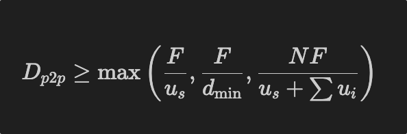
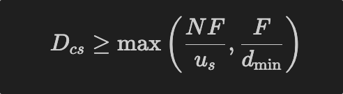
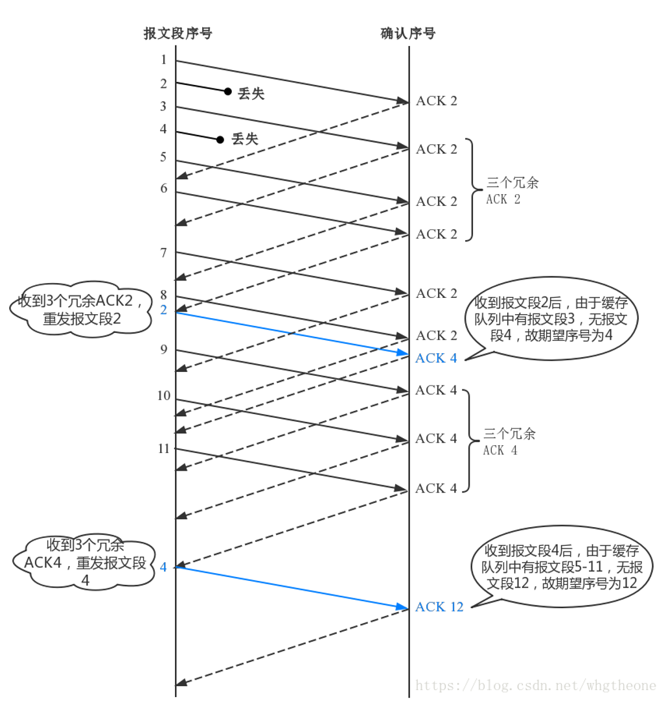
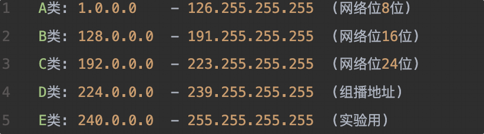
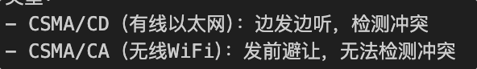

平时作业25% 实验25% 期末50%

作业: 3实验 三个大作业在超星上最后

三个大作业↓

https://mooc1.chaoxing.com/mycourse/studentstudy?chapterId=558001011&courseId=206041847&clazzid=117929825&cpi=337382960&enc=10f79751975371efec4a49f605f48af8&mooc2=1&openc=56668a172af25256dea4eea740dd22ad

单选2x10

简答9x4

小论文14(可能要问协议相关)

设计题15x2比如 画ip 子网划分 路由转发

## 第一章：

存储转发三个特点

> 先完整接收数据包 进行处理后在转发到下一跳
>
> 会引入转发延迟
>
> 但是提高可靠性

分层思想和体系，各层概念 涉及的流程和协议 网络设备（数据，报文，包，帧，比特流）

> 分层思想将复杂的网络通信分解为相对简单各司其职的层次 每层只关注特定功能

> 应用层直接面向用户 提供邮件 web等服务 数据 例如http DNS 设备是代理服务器 CDN

> 传输层 在两台主机间建立端到端通信 负责进程之间的通讯 提供可靠传输 拥塞控制 流量控制 数据是报文 叫做报文 设备是防火墙 负载均衡器 NAT 协议 TCP UDP

> 网络层 处理主机和主机之间的路由选择(怎么去) 逻辑寻址(在哪里) 转发包 数据包  IP BGP OSPF RIP    路由器 三层交换机

> 链路层处理邻接节点到邻接节点(一跳内)的传输和寻址 单位是帧 协议 ARP 以太网协议

> 流程在最后

包交换（以太网）与电路交换（FR）概念、特点、二者比较

> 包交换将数据分割成块 每个包独立寻址和路由 共享网络资源 不用预先建立端到端通路 动态自适应 资源利用力高 但是可能服务质量(QoS)不确定 造成延迟和丢包 延迟不稳定

> 电路交换预先建立端到端的专用(物理或逻辑)通路 数据沿固定路径传输 服务质量确定 延迟稳定 建立连接后开销小    但是总资源利用率低 无传输也占用资源

> 采用包交换:1.利用率高

> 异同: 同: 都需要网络基础设施 都在一定网络拓扑结构 目的功能服务对象都差不多

> 端到端时延 = 处理时延 + 排队时延 + 传输时延 + 传播时延

## 应用层：

> DNS定义、作用、工作原理

> DomailNameSystem 是分布式层次化的协议

> 负责域名和ip转换   提供cname 别名 (一个域名指向另一个域名)为邮件CDN提供负载均衡 一名多址

> 原理: 分布式 分层

> 根-顶级域(TopLevelDomain)-权威 根指向TLD TLD指向权威服务器

> 当用户查询域名时根不会直接指向域名会告诉去哪个TLD服务器查询

> 用户被指到TLD TLD不会返回ip而是告诉去那个权威服务器查询

> 权威服务器返回ip

> 本地递归解析器 把结果缓存TTL个小时 后续直接命中减少TLD负载

http-https

> http无状态 走80端口

> 分非持久性 持久性 持久性复用同一链接 是默认

> 服务器在发送响应后保持打开 客户端在遇到对象后立即请求

> 非持久性  每个http请求都独立的tcp链接 一个链接传输一个对象然后立刻关闭

HTTPS= HTTP+TLS/ssl加密了
ping、tracert、nslookup、ipconfig、arp-a（深刻理解）

> ping基于ICMP发送request和reply时间计算 检测是否可达和延迟 链路质量

> tracert基于ICMP和TTL机制  发送TTL递增的包 丢弃会发送TimeExceeded 就可以知道路径

> nslookup向dns服务器查询DNS解析信息

> ipconfig命令可以显示或更改本机的IP地址、子网掩码、网关、DNS等TCP/IP配置信息。

> arp -a 查询arp表 -d删除 -s添加

文件传输p2p SMTP POP3 IMAP邮件协议 CDN !!!!!!!!!!!!!!!邮件是考点新加!!!!!!!!!!!!!

> p2p去中心化不依赖单一节点 可靠性高 高容错 但管理复杂 节点数增加资源增长 带宽压力分散到节点
>
> 
>
> S/C结构 中心化 有客户端/服务器角色区分 依赖中心服务器 服务器风险 但集中管理容易 服务器资源可能为瓶颈 带宽压力大

> 邮件投递过程: 发件人UA写信-> 本地服务器充当SMTP客户端与收件人服务器建立TCP   消息被传递到收件人服务器的mailbox 收件人UA同构POP3 或者IMAP取信

> SMTP使用tcp/25 不使用udp 单次握手后保持连接直到会话结束  握手220 传输 250 关闭三个阶段

> pop3和IMAP都是邮件访问协议 POP3无状态 不用服务器文件夹单次tcp链接  早年pc客户端使用基本被淘汰

> IMAP 有状态 会保存已读等等文件夹 适用于多客户端同步 数据永远保存在服务器  命令强大

> CDN把视频/静态资源缓存到靠近用户的边缘节点

> 通过dns重定向(询问dns被返回到cdn 再被cdn自己的dns解析到最近的边缘ip)

## 传输层：

TCP特点，三次握手(会很细 ACK...需要极其熟悉) 四次挥手(会考比较简单)

> 特点 通信前建立连接 三次握手建立 四次挥手释放  可以确确保可靠传输

> 四个部分 连接管理 可靠传输 流量控制 拥塞控制

> 三次握手:

| **步骤** | **报文内容**              | **发送方状态**  | **接收方状态**  |
| -------- | ------------------------- | --------------- | --------------- |
| **①** | **SYN=1, Seq=x**          | **SYN-SENT**    | **LISTEN**      |
| **②**   | **SYN=1, ACK=x+1, Seq=y** | **SYN-RCVD**    | **SYN-SENT**    |
| **③**   | **ACK=y+1**               | **ESTABLISHED** | **ESTABLISHED** |

> 第一次 syn=1 seq=初始x

> syn = 1 seq=y ack x+1

> ack y +1

* **SYN 消耗 1 字节序号**：

  > - 在 TCP 中，SYN 报文会占用一个序列号（即 `Seq=x`），因此后续数据的序列号从 `x+1` 开始。
  >
* **丢包处理**：

  > - 如果第三次握手的 ACK 报文丢失，服务器会重发第二次握手的 SYN+ACK 报文，并继续等待客户端的 ACK。
  >

流量控制

> 滑动窗口 接收方会在每个ack中告知发送方自己的窗口(缓冲区-已接收未处理的量) 窗口字段在tcp头部

> (ack报文有  seq= ack= win=)

> 零窗口 发送方收到win=0后 停止发送数据定期发送只有1字节的窗口探测报文   这个定期是指数增长的

拥塞控制

> 拥塞控制有慢启动 拥塞避免 快速重传 快速恢复

拥塞控制

4.2 慢启动（Slow Start）

- **保守开始**：初始时只发送很少的数据测试网络
- **指数增长**：如果网络状况良好，发送量快速翻倍增长
- **探测带宽**：快速找到网络的承载能力上限
- **转换条件**：达到一定阈值后切换到更稳定的增长模式

### 4.3 拥塞避免（Congestion Avoidance）

#### 工作原理：

- **线性增长**：发送量缓慢稳定增长，避免突然冲击网络
- **稳定传输**：在接近网络容量时小心探测，保持稳定的传输速率
- **持续监控**：密切关注网络状况，准备应对拥塞信号

### 4.4 快速重传（Fast Retransmit）

#### 工作原理：

- **快速检测**：通过重复确认快速发现数据丢失
- **立即重传**：不等待超时就重传丢失的数据
- **减少延迟**：大幅缩短数据恢复时间，提高传输效率

### 4.5 快速恢复（Fast Recovery）

#### 工作原理：

- **快速响应**：检测到轻微拥塞时不回到最初的慢启动状态
- **适度调整**：降低发送速率但保持在较高水平
- **快速恢复**：网络恢复后迅速回到正常传输状态
- **避免震荡**：防止传输速率的剧烈波动

慢启动-拥塞避免-拥塞-快速重传-快速回复-拥塞避免--

> //基本确定小论文考

UDP 和tcp区别

> UDP无需建立连接 不用维护和释放连接 不可靠 头部比tcp小所以延迟好 吞吐量更高

SOCKET ip+端口号 简单考进程的通信

## 网络层：

网络层功能、作用、相关协议如何体现和实现这些功能 概论↑
IP地址：IPV4，主机可用IP，子网掩码， CIDR /  ,默认网关

> 默认网关一般是路由器地址  要转发到外网时的下一跳的地址
>
> ip分类
>
> 
>
> 网络地址标识这个网络 一般是.0什么的 二进制全为0
>
> 广播地址是.255最大的 二进制全为1

> 主机数量要-2 因为两个地址

什么是NAT网络地址转换，作用

> 边界路由器将私网地址映射到公网 维护转换表
>
> 节省ipv4 公私隔离 但是破坏端到端 P2P穿透复杂

**子网划分-好处，划分方法，划分过程，子网IP范围、掩码、网络地址、广播地址(也需要极其熟悉)

考虑扩容余量!!!!!!!!!!!!!!!!!!!!!!!!!!!!!!!!!

> 好处:效率 性能 安全 便于网络管理
>
> 方法
>
> 等长子网划分
>
> 变长子网划分

> 过程题中有 4.1数据平面)

路由协议 (概念,静态路由协议和动态路由协议) 简单了解OSPF和ICMP

> 路由协议 路由器之间交换路由信息的规则
>
> 静态管理员手动配置 动态自动学习
>
> 动态协议有1.距离向量协议(例如RIP)
>
> 2.链路状态协议 OSPF 3. 混合
>
> 按应用范围分IGP(RIO_OSPF)和EGP(BGP)

路由表（直连、静态、动态（IGP与EGP相关协议）、SDN）

Dijkstra算法，算法描述，计算过程，计算目的（核心考点!） 路径距离是传输时延之类)

> 要画路由表

SDN概念、目的、好处、架构构成

> SDN是软件定义网络 是将网络控制平面与数据平面分离的架构 通过集中控制器管理整个网络

目的和好处

> 简化管理 提高灵活性可编程性
>
> 降低排线接线成本提高效率
>
> 快速部署
>
> 降低运维成本 支持网络虚拟化和云计算
>
> 支持创新应用和服务

架构

> 1. 应用层：网络应用和服务
> 2. 控制层：SDN控制器（大脑）
> 3. 基础设施层：交换机等网络设备
>    通过北向接口(控制器与应用层通信)和南向接口（OpenFlow最主流）(控制器与设备通信)连接。

## 链路层：

下面简答或者选择:

TDMA/CDMA 信道划分协议 分时分码      CSMA 新加

> TDMA 时分多地 无冲突   卫星

> CDMA 码分 抗干扰 复杂 基站

> CSMA 载波侦听    wifi以太网

CRC 检测或校验数据传输或者保存后可能出现的错误 (大概了解) 新加

> 链路层错误检验方法，错误纠正机制，实现方法
> ARP作用、工作原理、工作过程、何时用 MAC地址
> LAN , VLAN概念、目的、优点.

> 局域网 实现同一区域内设备的网络通信

> 虚拟局域网 将物理网络划分为多个广播域

> 有了VLAN（虚拟局域网），Vlan内部的广播和单播流量就不会转发到其他Vlan中去。

> 1.限制了广播域，节省了带宽 2.灵活构建虚拟工作组 3.增强了局域网的安全性

以太网.交换机.路由器和交换机什么时候用谁 新加

MPLS指导数据报文和高速转发   --简单了解 新加

> MPLS（多协议标签交换）通过在数据包前添加**标签**来指导转发，实现高速数据传输。传统路由需要查找复杂的路由表，而MPLS只需简单的**标签查找**，大大提升转发效率。

## mibile

几种无线技术,应用场景 802.11

2g3g无线蜂窝网和wifi的区别

↑mibile以上简单了解就好

HTTPS 是一种应用层协议，是一种透过计算机网络进行安全通信的传输协议。
HTTPS 经由 HTTP 进行通信，但是在 HTTP 的基础上引入了一个加密层，使用 SSL/TLS 来加密数据包
HTTPS 开发的主要目的，是提供对网站服务器的身份认证，保护交换数据的隐私与完整性。
HTTPS 默认工作在 TCP 协议443端口

nslookup：查询DNS的记录，查看域名解析是否正常，在网络故障的时候用来诊断网络问题。
server：本机DNS服务器信息
Non-authoritative answer：非权威应答。除非实际存储DNS Server中获得域名解析回答的，都称为非权威应答。也就是从缓存中获取域名解析结果。
address：目标域名对应物理IP可有多个
Tracert命令可以用来跟踪数据报使用的路由（路径）。该实用程序跟踪的路径是源计算机到目的地的一条路径，不能保证或认为数据报总遵循这个路径。

ipcongif命令：使用不带参数的ipconfig命令可以显示所有适配器的ip 地址，子网掩码和默认网关等；

计算机网络各层的设备如下:
物理层：网卡（物理层和链路层）、网线、集线器、中继器、调制解调器
数据链路层：网桥、交换机
网络层：路由器、防火墙、多层交换机
传输层：进程和端口
应用层：应用程序，如FTP，SMTP，HTTP

网络分层思想是一种将网络通信功能分解为一系列层的思想，每一层提供特定的服务，并与其他层次通过标准化的接口进行通信。
分层的主要好处有：
1、各层之间是独立的，每一层向上和向下通过层间接口提供服务，无需暴露内部实现
2、灵活性好
3、结构上可分割
4、易于实现和维护
5、能促进标准化工作

1.笔记本需要一个IP地址，网关地址，DNS的地址，这些都可以采用DHCP来获得。
2.DHCP请求报文先被封装到UDP中，然后再封装到目的IP为255.255.255.255的IP数据报中，最后再封装到以太网广播帧中。
3.以太网帧在LAN上广播, 被运行中的DHCP服务器接收到
4.在DHCP服务器上解封装IP数据报，解封装UDP，得到DHCP报文
5.DHCP 服务器生成DHCP ACK 报文，里面包含客户端的IP地址，子网掩码，网关IP地址和DNS服务器地址
6.在DHCP服务器上经过层层封装成帧，经过在LAN中的转发，最终被客户机接收到。
7.客户机接收到DHCP ACK报文后，就可以配置所有接收到的上网参数，并开始上网。

8,在发送HTTP request请求之前, 需要知道www.google.com的IP地址,所以要生成一个DNS查询报文
9，而发送DNS查询报文要经过路由器，所以需要通过ARP广播来知道路由器接口的的MAC地址。
10，发送目的IP为网关IP，目的MAC为全1的ARP查询广播，并被路由器接收到。
11.路由器发送ARP响应，给出网关接口的MAC地址。
12.，客户机接收到ARP响应后，就可以把DNS查询报文封装在UDP中，在封装在IP数据报中，在封装在以太网帧中（目的IP为DNS服务器IP，目的MAC地址是网关的MAC地址）

13.包含DNS查询的IP数据报，经过多次根据路由表的转发后（路由表依据RIP，OSPF，BGP协议来创建），最终到达了DNS服务器。
14.DNS服务器解封装出来DNS查询报文，在数据库中找到www.google.com的IP地址，并生成DNS回答报文发送给客户机。
15.客户机从DNS回答报文中解封装出www.google.com的IP地址。

16.客户机生成TCP套接字，来发送HTTP请求
17.开始握手，发送目的端口80的TCP SYN报文段并路由到web服务器
18.web服务器接收到后，用TCP SYNACK来应答，并发送给客户机
19.客户机接收到后，发送HTTP请求报文到套接字中，并生成一个包含HTTP请求的TCP ACK报文段，然后再封装到IP数据报中并路由到www.google.com的IP地址
20，web服务器接收到后，生成一个HTTP响应报文（包含web页面内容），并发送给客户机
21.客户机接收到后，从套接字中读取HTTP响应报文，从中解封装出web页面的内容并显示在屏幕上。
