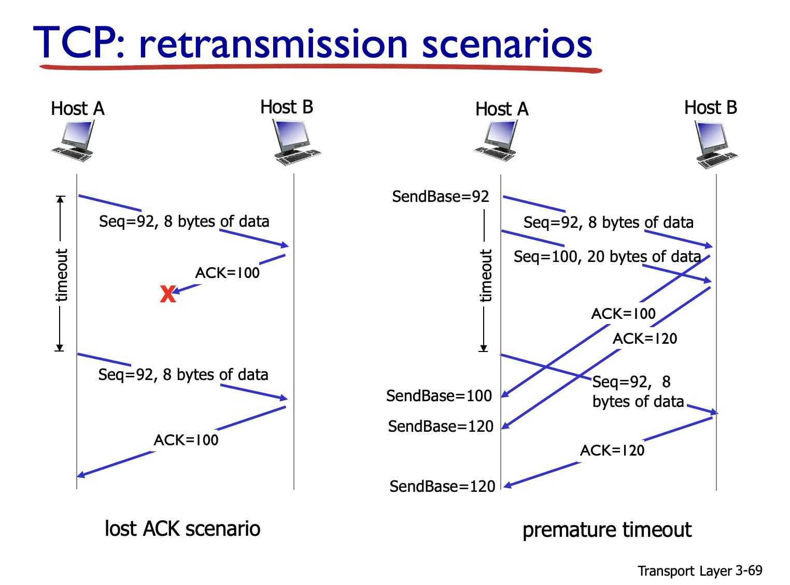
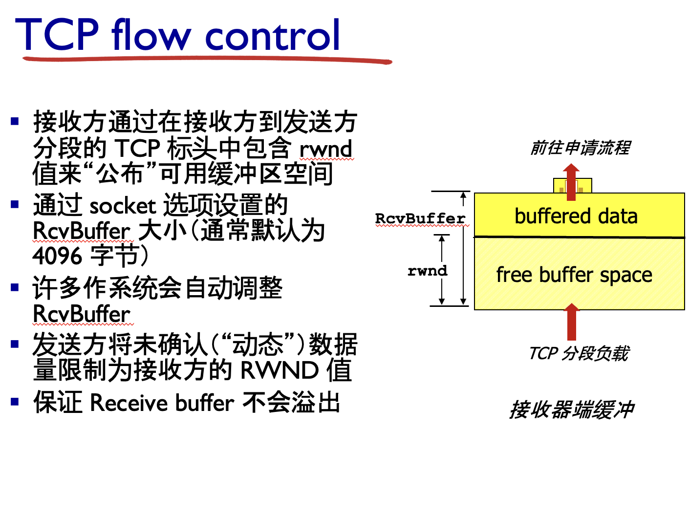

# 传输层

## 传输层：

TCP特点，三次握手(会很细 ACK...需要极其熟悉) 四次挥手(会考比较简单) tcp流量控制 拥塞控制

> //基本确定小论文考

UDP 和tcp区别
SOCKET ip+端口号 简单考进程的通信

cache:


| 出现顺序 | PPT 小节标题（首张“蓝条”标题）                                         | 你要看的具体页（常用子标题）                                                                                                                           | 对应考点                                        |
| -------- | ------------------------------------------------------------------------ | ------------------------------------------------------------------------------------------------------------------------------------------------------ | ----------------------------------------------- |
| ①       | **3.2 Multiplexing and Demultiplexing**                                  | *How demultiplexing works*/*Connection-oriented demux*Chapter\_3\_V7.01-Transpo…                                                                      | **Socket = IP + 端口，进程通信**                |
| ②       | **3.3 Connectionless Transport: UDP**                                    | *UDP: User Datagram Protocol*/*UDP segment header*/*Why is there a UDP?*Chapter\_3\_V7.01-Transpo…                                                    | **UDP 与 TCP 区别**（无连接、8 B 头、无拥控等） |
| ③       | **3.5 Connection-oriented Transport: TCP**                               | *TCP: Overview*（列出 full-duplex、可靠、流控、拥控…）**Chapter\_3\_V7.01-Transpo…**                                                                 | **TCP 特点**                                    |
| ④       | **3.5 Connection-oriented Transport: TCP**                               | *TCP 3-way handshake*（含 FSM 图）**Chapter\_3\_V7.01-Transpo…**                                                                                      | **三次握手（细节）**                            |
| ⑤       | **3.5 Connection-oriented Transport: TCP**                               | *TCP: closing a connection*（两页示意）**Chapter\_3\_V7.01-Transpo…**                                                                                 | **四次挥手**                                    |
| ⑥       | **3.5 Connection-oriented Transport: TCP**                               | *TCP flow control*（rwnd 图）**Chapter\_3\_V7.01-Transpo…**                                                                                           | **TCP 流量控制**                                |
| ⑦       | **3.6 Principles of Congestion Control**→**3.7 TCP Congestion Control** | *Principles of congestion control*（三种场景）**Chapter\_3\_V7.01-Transpo…**→*TCP congestion control / Slow Start / AIMD*Chapter\_3\_V7.01-Transpo… | **TCP 拥塞控制**（慢启动、AIMD、快速恢复）      |

# 3.1 传输层服务

传输层是网络协议栈中的第四层，主要负责**主机之间的进程通信**，即在主机到主机的基础上，进一步实现**进程到进程**的逻辑通信

主要功能是为运行在不同主机上的应用进程提供逻辑通信服务，使它们看起来像是直接连接的。传输层协议（如 TCP 和 UDP）运行在终端系统中：

1. **发送端**：将应用层消息分割成段（segments），传递给网络层。
2. **接收端**：将网络层传来的段重新组装成消息，传递给应用层。

> * **网络层**：主机 ↔ 主机（house ↔ house）；
> * **传输层**：进程 ↔ 进程（house 里的 kid ↔ kid）。

互联网中，传输层为应用程序提供两种主要协议：

* **TCP**：可靠、面向连接。
* **UDP**：不可靠、无连接。

### 传输层提供的四项核心服务


| 服务             | 含义（一句话）                        | 谁来提供  |
| ---------------- | ------------------------------------- | --------- |
| **复用与分用**   | 用**端口号**把不同进程的数据混合/分流 | UDP + TCP |
| **可靠数据传输** | 检错、重传、按序、无损                | **TCP**   |
| **流量控制**     | 防止**接收端**缓存溢出（rwnd）        | **TCP**   |
| **拥塞控制**     | 防止**网络内部**过载（cwnd + AIMD）   | **TCP**   |

# 3.2 多路复用和分用(解多路复用)(socket是考点 考进程间通讯)

#### 1 为什么要“多路复用 / 分用”

* 同一台主机往往同时跑多个应用进程。
* **IP 只能把分组送到目标主机**；还需一种机制把该分组再分发给正确的进程。
* 传输层通过在段首部加入 **端口号** 实现此目标，这个过程就叫 **复用（发送侧混流）/分用（接收侧拆流）**Chapter\_3\_V7.01-Transpo…。

---

#### 2 \*Socket＝IP 地址 + 端口号(要考)

> 要考

* **\*Socket** 是“进程与网络的接口”。凡是收／发数据，都必须先绑定一个 *〈本地 IP， 本地端口〉*。
* 在代码里，`new Socket("10.0.0.3",80)` 或 `DatagramSocket(12534)` 就是在创建 socket。
* 一台主机可有成千上万个并发 socket，只要端口号不同即可（0–65535）。

### 1. **多路复用（Multiplexing）**

#### 定义

- **多路复用**是指在发送端，传输层将来自多个应用进程的数据封装到不同的传输层段（segments）中，并通过网络层发送到目标主机。
- 每个段都包含一个标识应用进程的标识符（如端口号）。

#### 工作流程

1. 应用层的多个进程向传输层发送数据。
2. 传输层为每个进程分配一个唯一的标识符（通常是端口号）。
3. 传输层将数据封装成段，并附加端口号等信息。
4. 传输层将段传递给网络层进行传输。

#### 关键点

- **端口号**：用于区分不同的应用进程。
- **发送端**：负责将多个应用进程的数据复用到同一个传输层协议（如 TCP 或 UDP）中。

### 2. **解多路复用（Demultiplexing）**

#### 定义

- **解多路复用**是指在接收端，传输层根据段中的标识符（如目标端口号）将数据分发给正确的应用进程。
- 传输层通过检查段头中的信息，确定数据属于哪个应用进程。

#### 工作流程

1. 接收端的传输层从网络层接收段。
2. 传输层检查段头中的目标端口号。
3. 根据端口号，将数据分发给对应的应用进程。

#### 关键点

- **端口号匹配**：传输层通过目标端口号找到对应的应用进程。
- **接收端**：负责将接收到的数据正确分发给对应的应用程序。

### 4. **实现机制**

#### 端口号

- **端口号**是多路复用和解多路复用的核心。
- 每个应用进程都绑定一个唯一的端口号，用于标识通信的目标或来源。

#### 传输层协议

- **TCP** 和 **UDP** 都支持多路复用和解多路复用，但方式不同：

  - **TCP**：面向连接，每个连接由四元组（源 IP、源端口、目标 IP、目标端口）唯一标识。
  - **UDP**：无连接，使用二元组（目标 IP、目标端口）就是少了来源标识。

# 3.3 UDP

#### 1  基本特性 （全部为考点，均加 **\***）

* **\*无连接**：发送前**不握手**，接收后也不确认。
* **\*尽最大努力交付**：不保证按序、不保证必达、不重传。
* **\*无流控、无拥控**：发送速率完全由应用决定，不受 rwnd / cwnd 约束。
* **\*首部仅 8 B**：`源端口(2) 目的端口(2) 长度(2) 校验和(2)`，与 TCP ≥20 B 对比显著。
* **\*校验和**：UDP 仍在首部最后 2 B提供端到端差错检测（覆盖伪首部、首部与数据），若不用可写 0。

#### 端口与分用

* **发送端**：应用调用 `sendto()` → OS 填 **源端口**（可随机）与目标端口。
* **接收端**：协议栈只看 **目的端口** → 把段递交给对应 socket（见 3.2）。
  （因此 DNS 服务器 53 端口可同时服务来自任意客户端。

### 应用场景:


| 协议 / 应用                | 采用 UDP 的原因                            |
| -------------------------- | ------------------------------------------ |
| **DNS**、SNMP、DHCP        | 请求小且重试逻辑在应用层；握手会徒增时延。 |
| **实时音/视频 (RTP/RTCP)** | 轻微丢包优于重传时延；应用自己做容错。     |
| **在线游戏、VoIP**         | 需要固定节拍、低抖动；应用可接受少量丢包。 |

# ********TCP与UDP差异(要考! 重点)


| 维度     | **UDP**                | TCP                   |
| -------- | ---------------------- | --------------------- |
| 连接     | **\*无握手**           | 三次握手、四次挥手    |
| 可靠性   | **\*不保证**，应用自管 | 超时/重复 ACK 重传    |
| 流/拥控  | **\*无**               | rwnd 流控 + AIMD 拥控 |
| 首部长度 | **\*8 B**              | ≥20 B，可含选项      |
| 吞吐     | 由应用自行控制         | 受 cwnd 与 RTT 影响   |
| 适用业务 | DNS、VoIP、RTP         | Web、FTP、SMTP        |

# 3.4 RDT协议 可靠数据传输协议(TCP的一部分)

### RDT 协议（Reliable Data Transfer Protocol）

**RDT（Reliable Data Transfer）** 是一种可靠数据传输协议，主要用于确保数据在不可靠的网络（如丢包、乱序、损坏等）中能够正确传输。它是计算机网络中传输层协议（如 TCP）的核心概念之一。

---

### **RDT 的目标**

- 在可能存在数据丢失、损坏或乱序的网络环境中，提供可靠的数据传输服务。
- 确保数据从发送方正确传输到接收方，且顺序无误。

---

### **RDT 的主要问题**

1. **数据丢失**：网络可能会丢弃部分数据包。
2. **数据损坏**：传输过程中，数据可能会被损坏。
3. **数据乱序**：接收方可能收到乱序的数据包。
4. **确认丢失**：接收方的确认（ACK）可能丢失，导致发送方重复发送数据。

### **RDT 的版本演进**

#### **1. RDT 1.0**

- **特点**：假设底层网络是完全可靠的，没有数据丢失、损坏或乱序。
- **实现**：
  - 发送方直接发送数据，接收方直接接收数据。
  - 不需要任何额外的机制。
- **局限性**：仅适用于理想网络环境，无法应对实际网络中的问题。

#### **2. RDT 2.0**

- **特点**：处理数据损坏问题。
- **实现**：
  - 使用校验和（Checksum）检测数据是否损坏。
  - 接收方发送确认（ACK）或否认（NAK）：
    - **ACK**：表示数据正确接收。
    - **NAK**：表示数据损坏，要求重传。
  - 发送方在收到 NAK 时重传数据。
- **局限性**：
  - 如果 ACK 或 NAK 丢失，发送方无法判断是否需要重传。

#### **3. RDT 2.1**

- **特点**：处理 ACK/NAK 丢失问题。
- **实现**：
  - 引入序列号（Sequence Number）：
    - 每个数据包附带一个序列号，用于区分新旧数据包。
  - 接收方通过序列号判断是否是重复数据。
  - 即使 ACK 或 NAK 丢失，发送方也能通过超时重传机制确保数据可靠传输。

### **4. RDT 2.2：无 NAK 协议**

* **特点**：
  * 不使用 NAK，只用 ACK。
  * 接收方通过重复发送最后一个正确接收的 ACK 来通知发送方重新发送数据。
  * 解决了 NAK 损坏的问题。
* **缺陷**：
  * 没有考虑数据包丢失的情况。

#### **4. RDT 3.0**

- **特点**：处理数据丢失问题。
- **实现**：
  - 引入超时重传机制：
    - 发送方在发送数据后启动定时器。
    - 如果在超时时间内未收到 ACK，发送方会重传数据。
  - 结合序列号，避免重复数据的处理问题。
- **局限性**：
  - 效率较低，尤其是在高延迟网络中，等待超时会浪费时间。

---

### **RDT 的核心机制**

1. **校验和（Checksum）**：

   - 用于检测数据是否损坏。
   - 接收方通过校验和验证数据完整性。
2. **序列号（Sequence Number）**：

   - 用于区分新旧数据包，避免重复数据的处理。
3. **确认机制（ACK/NAK）**：

   - **ACK**：接收方确认数据正确接收。
   - **NAK**：接收方通知发送方数据损坏，需要重传。
4. **超时重传（Timeout Retransmission）**：

   - 发送方在超时时间内未收到 ACK，会重传数据。

---

### **RDT 的局限性**

- **低效率**：
  - 每次发送数据都需要等待 ACK，导致吞吐量低。
  - 在高延迟网络中，超时重传会进一步降低效率。
- **不适合大规模数据传输**：
  - RDT 的基本模型适用于简单的可靠传输，但在实际网络中需要更复杂的机制（如 TCP 的流量控制和拥塞控制）。

---

### **RDT 与 TCP 的关系**

- RDT 是可靠数据传输的理论模型，TCP 是其实际实现。
- TCP 在 RDT 的基础上增加了：
  - **流量控制**：防止发送方发送过快，导致接收方处理不过来。
  - **拥塞控制**：防止网络过载。
  - **滑动窗口**：提高传输效率，允许发送多个未确认的数据包。

---

# TCP (考点! 重点考三次握手 一般考四次挥手 剩下考拥塞控制和流量控制部分)

TCP实际上有四个主要部分:

#### 1. 连接管理

* **三次握手**：建立连接
  * SYN, SYN+ACK, ACK
    SYN是cyhchronize同步的缩写
* **四次挥手**：断开连接
  * FIN, ACK, FIN, ACK

#### 2. 可靠传输机制

* **序列号**：标识报文段顺序
* **确认应答(ACK)**：确认收到数据
* **校验和**：确保数据完整性
* **超时重传**：处理丢包情况

#### 3. 流量控制

* **滑动窗口**机制
* 避免发送方发送速率超过接收方处理能力
* 通过 Window Size 字段实现

#### 4. 拥塞控制

* **慢启动**
* **拥塞避免**
* **快速重传**
* **快速恢复**
* 防止网络过载

## 1 TCP 链接管理 \*

* **面向连接**：三次握手建立、四次挥手释放。
* **全双工、面向字节流**：序号以字节计；应用看不到“报文边界”。
* **可靠 + 流量控制 + 拥塞控制**：三者均由发送端算法保证，而 UDP 全部缺省。

#### 2 段（segment）结构 \*

```
┌─20B 基本首部───────────────┐
│  源端口 ｜ 目的端口 (各 16)│
│  序号 (32)                │
│  确认号 (32)              │
│  数据偏移｜保留｜标志位   │
│  接收窗口 rwnd (16)        │
│  校验和 (16)｜紧急指针    │
└─可变长选项 (MSS、SACK…)───┘
```

常用标志：**SYN → 建立**，**FIN → 关闭**，**ACK = 1 表示确认号有效**。

---

#### 3 序号、确认号与 ACK 规则 \*

* **Seq** = 本段数据“首字节序号”。
* **Ack** = 期望下一个字节序号（累积 ACK）。
* RFC 1122 指定接收端 **推迟 ACK** 最多 500 ms；若连续收两段可一次性 ACK 两段。若收 **乱序段**，立即发 **重复 ACK** 表示缺口。


|  |  |  |
| - | - | - |

### **TCP 三次握手详解**

**三次握手**是 TCP 协议中用于建立可靠连接的过程，确保通信双方都准备好发送和接收数据，并且确认网络的可靠性。

---

### **三次握手的步骤**


| **步骤** | **报文内容**              | **发送方状态**  | **接收方状态**  |
| -------- | ------------------------- | --------------- | --------------- |
| **①** | **SYN=1, Seq=x**          | **SYN-SENT**    | **LISTEN**      |
| **②**   | **SYN=1, ACK=x+1, Seq=y** | **SYN-RCVD**    | **SYN-SENT**    |
| **③**   | **ACK=y+1**               | **ESTABLISHED** | **ESTABLISHED** |

> 要点：SYN 消耗 1 字节序号；若第 ③ 段丢失，服务器会重发第 ② 段并等待 ACK。

### **三次握手的详细过程**

#### **1. 第一次握手**

- **客户端**发送一个 **SYN** 报文，表示请求建立连接。
  - 报文内容：`SYN=1, Seq=x`
    - **SYN**：同步标志位，表示请求建立连接。
    - **Seq=x**：初始序列号，表示客户端的序列号起点。
  - **状态变化**：
    - 客户端进入 **SYN-SENT** 状态，等待服务器响应。

#### **2. 第二次握手**

- **服务器**收到客户端的 SYN 报文后，发送一个 **SYN+ACK** 报文，表示同意建立连接。
  - 报文内容：`SYN=1, ACK=x+1, Seq=y`
    - **SYN=1**：表示服务器也请求建立连接。
    - **ACK=x+1**：确认客户端的序列号 `x`，并告知下一个期望的序列号是 `x+1`。
    - **Seq=y**：服务器的初始序列号。
  - **状态变化**：
    - 服务器进入 **SYN-RCVD** 状态，等待客户端的确认。

#### **3. 第三次握手**

- **客户端**收到服务器的 SYN+ACK 报文后，发送一个 **ACK** 报文，表示确认连接建立。
  - 报文内容：`ACK=y+1`
    - **ACK=y+1**：确认服务器的序列号 `y`，并告知下一个期望的序列号是 `y+1`。
  - **状态变化**：
    - 客户端进入 **ESTABLISHED** 状态，连接建立完成。
    - 服务器收到 ACK 后，也进入 **ESTABLISHED** 状态。

---

### **关键点解析**

1. **SYN 消耗 1 字节序号**：

   - 在 TCP 中，SYN 报文会占用一个序列号（即 `Seq=x`），因此后续数据的序列号从 `x+1` 开始。
2. **丢包处理**：

   - 如果第三次握手的 ACK 报文丢失，服务器会重发第二次握手的 SYN+ACK 报文，并继续等待客户端的 ACK。
3. **可靠性**：

   - 三次握手确保了双方的发送和接收能力：
     - 第一次握手：客户端确认自己可以发送数据。
     - 第二次握手：服务器确认自己可以接收数据，并告知客户端自己可以发送数据。
     - 第三次握手：客户端确认自己可以接收数据。

---

### **报文中的字段含义**

1. **SYN（Synchronize）**：

   - 表示请求建立连接。
   - 只有在连接建立阶段才会使用。
2. **ACK（Acknowledgment）**：

   - 确认标志位，表示对对方发送的数据或请求的确认。
3. **Seq（Sequence Number）**：

   - 序列号，用于标识数据包的顺序。
   - 每个数据包都有一个唯一的序列号。
4. **ACK Number**：

   - 确认号，表示接收方期望接收的下一个序列号。

---

### **三次握手的意义**

1. **确保双方通信能力**：

   - 确保客户端和服务器都能发送和接收数据。
2. **防止旧连接干扰**：

   - 通过序列号，避免旧的重复连接请求对当前连接的影响。
3. **建立可靠连接**：

   - 在数据传输前，双方确认连接的可靠性。

---

#### 5 连接释放：四次挥手

1. 主动端 **FIN**, Seq =u → **FIN-WAIT-1**
2. 被动端 **ACK=u+1** → **FIN-WAIT-2 / CLOSE-WAIT**
3. 被动端准备好后发 **FIN**, Seq =v
4. 主动端 **ACK=v+1** 并等待 **2 MSL** 定时器 → CLOSED
   半关闭确保双向数据都收到确认，因此比三次多一步。

## 可靠传输机制

2.1 序列号（Sequence Number）

- **作用**：为每个字节分配唯一编号，确保数据有序
- **特点**：连接建立时随机选择起始值，防止旧连接数据干扰
- **功能**：接收方通过序列号重排乱序数据，检测重复数据

### 2.2 确认应答（ACK）机制

#### 基本原理：

- **确认号**：告诉发送方期望收到的下一个字节编号
- **累积确认**：一个确认号表示之前所有数据都已正确接收
- **双向机制**：通信双方都使用序列号和确认号

#### ACK 发送策略：

1. **立即确认**：收到乱序数据或重复数据时立即发送
2. **延迟确认**：正常情况下等待一小段时间，尝试与后续数据的确认合并，节省网络资源

### 2.3 校验和（Checksum）

- **作用**：检测数据在传输过程中是否出错
- **范围**：覆盖TCP首部和数据部分
- **处理**：发现错误直接丢弃报文，依靠重传机制恢复

### 2.4 超时重传机制

- **原理**：发送数据后启动定时器，超时未收到确认就重传
- **自适应**：根据网络状况动态调整超时时间
- **退避策略**：连续重传失败时逐渐增加等待时间
- **限制**：超过最大重传次数后放弃连接
- 2. 可靠传输机制

---

## 3. 流量控制

### 3.1 滑动窗口机制

#### 核心思想：

- **发送窗口**：限制发送方一次能发送多少未确认的数据
- **接收窗口**：接收方告知发送方自己还能接收多少数据
- **动态调整**：根据接收方处理能力实时调整发送速率

### 3.2 窗口工作过程

- **发送数据**：在窗口范围内可以连续发送多个数据包
- **收到确认**：窗口向前滑动，可以发送新的数据
- **窗口更新**：接收方处理数据后更新可接收的数据量

### 3.3 零窗口处理

- **零窗口**：接收方缓存满时通知发送方暂停发送
- **窗口探测**：发送方定期查询接收方是否恢复接收能力
- **恢复传输**：接收方处理完数据后重新开放接收窗口

### 3.4 效率优化

- **避免小窗口**：防止频繁的小数据传输降低网络效率
- **批量处理**：积累足够数据或窗口后再进行传输



---

## 4. 拥塞控制

### 4.1 拥塞控制概述

拥塞控制是防止网络过载的机制，通过四个核心算法协同工作：慢启动、拥塞避免、快速重传、快速恢复。

### 4.2 慢启动（Slow Start）

#### 工作原理：

- **保守开始**：初始时只发送很少的数据测试网络
- **指数增长**：如果网络状况良好，发送量快速翻倍增长
- **探测带宽**：快速找到网络的承载能力上限
- **转换条件**：达到一定阈值后切换到更稳定的增长模式

### 4.3 拥塞避免（Congestion Avoidance）

#### 工作原理：

- **线性增长**：发送量缓慢稳定增长，避免突然冲击网络
- **稳定传输**：在接近网络容量时小心探测，保持稳定的传输速率
- **持续监控**：密切关注网络状况，准备应对拥塞信号

### 4.4 快速重传（Fast Retransmit）

#### 工作原理：

- **快速检测**：通过重复确认快速发现数据丢失
- **立即重传**：不等待超时就重传丢失的数据
- **减少延迟**：大幅缩短数据恢复时间，提高传输效率


### 4.5 快速恢复（Fast Recovery）

#### 工作原理：

- **快速响应**：检测到轻微拥塞时不回到最初的慢启动状态
- **适度调整**：降低发送速率但保持在较高水平
- **快速恢复**：网络恢复后迅速回到正常传输状态
- **避免震荡**：防止传输速率的剧烈波动

### 4.6 算法协调工作

这四个算法根据网络状况自动切换：

- **网络良好**：从慢启动快速提升到拥塞避免的稳定传输
- **轻微拥塞**：通过快速重传和快速恢复快速应对
- **严重拥塞**：回到慢启动重新探测网络容量
- **动态平衡**：在充分利用带宽和避免拥塞之间找到最佳平衡点

### 4.7 拥塞控制的意义

- **网络稳定**：防止整个网络因过载而崩溃
- **公平性**：确保多个连接公平分享网络资源
- **效率最大化**：在保证稳定的前提下充分利用网络带宽
- **自适应性**：根据实时网络状况动态调整传输策略


# TCP ACK 确认机制的四种情况详解

## 情况1：顺序到达且没有未发出的ACK

### 场景描述

接收方收到了完全符合期望的数据段，且当前没有等待发送的ACK。

### 具体例子

```
期望序号：1000
收到数据：seq=1000，长度100字节
状态：前面的数据都已经确认完毕
```

### 处理策略

- **不立即发送ACK**，而是启动500ms的延迟定时器
- 在等待期间观察是否会收到下一个连续的数据段
- 如果500ms内没有新数据到达，则发送ACK=1100

### 优化目的

通过延迟可能将两个ACK合并成一个，减少网络开销和系统中断次数。

---

## 情况2：顺序到达且已有ACK挂起

### 场景描述

在延迟ACK的500ms等待期间，又收到了下一个连续的数据段。

### 具体例子

```
第一个段：seq=1000，长度100字节（启动延迟ACK）
第二个段：seq=1100，长度100字节（在500ms内到达）
```

### 处理策略

- **立即发送一个累积ACK**，不再等待500ms
- 发送ACK=1200，一次性确认两个数据段

### 优化目的

既实现了ACK合并的目标，又避免了过度延迟影响发送方的窗口滑动。

---

## 情况3：收到高于期望序号的段（出现缺口）

### 场景描述

收到的数据段序号超出了期望值，说明中间有数据丢失或乱序。

### 具体例子

```
期望序号：1000
实际收到：seq=1200，长度100字节
缺口：seq=1000-1199的数据缺失
```

### 处理策略

- **立即发送重复ACK**，ACK号仍然是1000（期望的序号）
- 每收到一个乱序段都发送相同的重复ACK
- 不更新确认号，保持指向缺失数据的起始位置

### 触发机制

当发送方收到3个相同的重复ACK时，会触发快速重传算法，立即重传丢失的数据。

---

## 情况4：收到填补缺口的段

### 场景描述

之前丢失或乱序的数据终于到达，可以填补之前的数据缺口。

### 具体例子

```
之前状态：期望1000，已收到1200-1299，存在缺口
现在收到：seq=1000，长度200字节
结果：缺口被填补，数据连续到1299
```

### 处理策略

- **立即发送ACK**，将确认号更新到新的连续数据末尾
- 发送ACK=1300，表示1000-1299的数据都已正确接收
- 停止发送重复ACK

### 恢复作用

通知发送方数据已正确接收，可以停止重传并恢复正常的拥塞窗口增长。

---

## 四种情况的协调作用

1. **情况1&2**：优化正常传输的效率，减少不必要的ACK流量
2. **情况3**：快速检测和报告数据丢失，触发快速重传
3. **情况4**：及时确认数据恢复，让传输回到正常轨道

这四种机制共同保证了TCP既能高效传输，又能快速处理各种异常情况，是TCP可靠传输的重要基础。


### 为什么 **2-way handshake** 不可靠 —— PPT 3-82 两个失败示例解析

> 记号说明
> `req_conn(x)`：连接请求段，初始序号 **ISN = x**
> `acc_conn(x)`：对该请求的确认（含 ACK=x+1）
> `data(x+1)`：后续数据段，首字节序号 x+1
> **ESTAB**：端点进入 *ESTABLISHED* 状态

---

#### 场景 A **ACK 丢失 → 半开连接**

```text
     Client                    Server
       | req_conn(x) ────────▶ (ESTAB)          (1)
       |            <─── acc_conn(x)            (2 Lost)
(3 Retrans) req_conn(x) ───▶ (resends acc)      (3)
  ··· 连接最终成功 ···
---Client 正常关闭--- ---------------------------+
       |  FIN/ACK  ──▶ (Lost)                    |  Client已退出
       |              X                         (Server仍 ESTAB) (4)
```

1. 客户端发送 `req_conn(x)`；服务器应答 `acc_conn(x)` 并转入 **ESTAB**
2. 该确认 **丢失**，客户端超时后再次发送 `req_conn(x)`
3. 双方终于都 **ESTAB**，数据可正常交换
4. 之后客户端终止并释放端口，但 **最后的 FIN 丢失** → 服务器一直保持连接，不断重传已确认的数据：**半开连接**（no client）

> **问题**：仅两次握手无法确保 *双方都知道对方已收到自己的确认*。丢一次包就可能留下孤儿连接，浪费资源。

---

#### 场景 B **旧 SYN 复现 → 数据错配**

```text
旧连接     Client                 Server
(早已结束)   | …———×                |   (忘记x)
            ···(时滞，网络残留 req_conn(x))···
新连接     Client                 Server
 choose x   | req_conn(x) ───────▶ (ESTAB)      (1)  ※其实是旧包
            |            <─── acc_conn(x)       (2)
 send data  | data(x+1)  ───────▶                (3 Lost)
(客户端以为连接正常)         Server再次收到
              req_conn(x) (旧包再次到来) ─▶ acc ESTAB
                                         (4 混淆，重新接受x+1数据)
```

1. **陈旧的连接请求**`req_conn(x)` 在网络中延迟很久后抵达服务器
2. 服务器误以为是“新会话”，回答 `acc_conn(x)` 并接受序号 **x**
3. 真正的新数据 `data(x+1)` 来到，但服务器**尚未收到**；
4. 又一份旧 `req_conn(x)` 到达，服务器再次重置状态，仍以 **x** 为起点。后续 `data(x+1)` 被当成 **首字节之外的数据**，造成内容错乱。

> **问题**：如果缺少来自客户端的 *最终确认*，服务器无法判断这份 `req_conn(x)` 是否 “全新” 还是 “陈旧复制品”，会误建立伪连接并接受脏数据。

---

### 三次握手如何根治

1. **SYN-ACK 必须得到显式 ACK**
   * 客户端对服务器的 `SYN+ACK` 再回一个 **ACK(y+1)**，服务器**只有**在收到它后才进入 ESTAB，从而消除了**半开连接**风险。
2. **使用对端序号进行否定检查**
   * 客户端在第三步 ACK 里带上自己期望的序号 → 若服务器当前仍停留在旧连接 context，它的期望序号将不匹配，此 ACK 会被丢弃，连接无法误建立。

> **总结一句**
> *三次握手让双方都握有“我确认你已确认”这一事实，并用第三步 ACK 鉴别陈旧 SYN，彻底避免 2-way handshake 导致的半开连接和旧包重现问题。*
>
