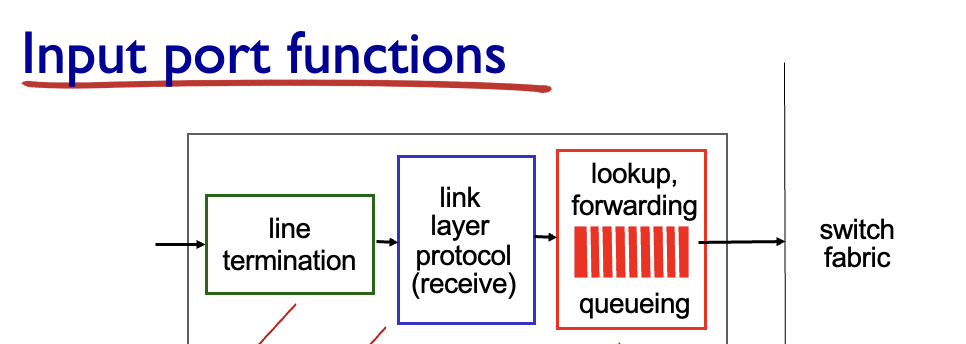
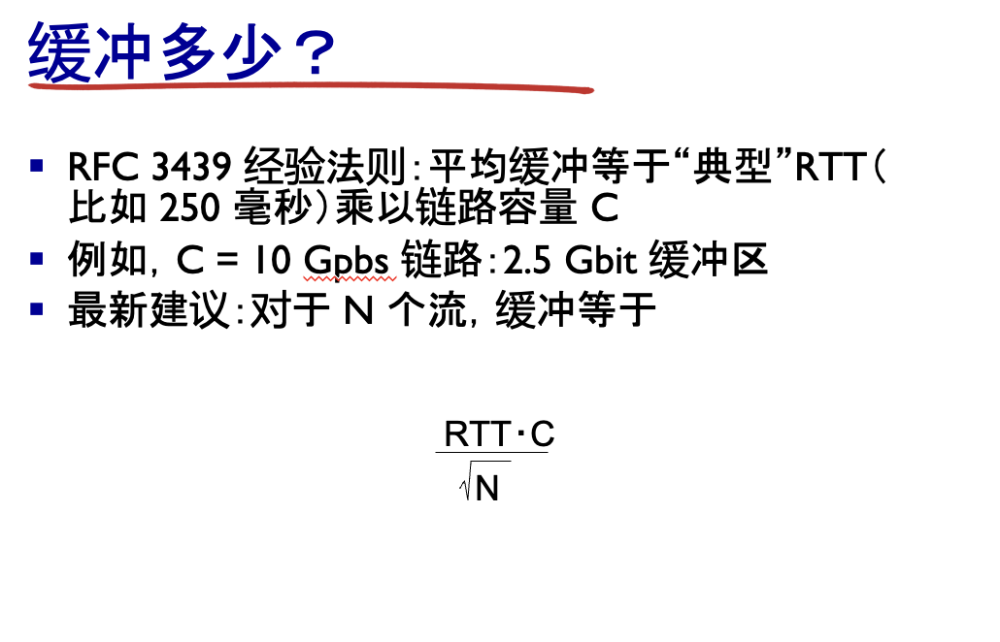
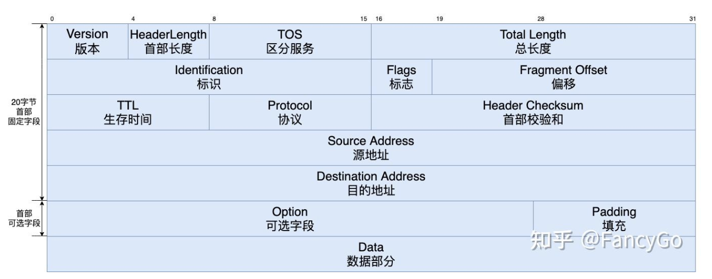

# 考点

网络层功能、作用、相关协议如何体现和实现这些功能

IP地址：IPV4，主机可用IP，子网掩码， CIDR ,默认网关

> 可能考design

什么是NAT网络地址转换，作用
**子网划分-好处，划分方法，划分过程，子网IP范围、掩码、网络地址、广播地址(也需要极其熟悉)**

> * (disign 大题) 比如给ip让人做子网划分*

路由协议 (概念,静态路由协议和动态路由协议) 简单了解OSPF和ICMP
路由表（直连、静态、动态（IGP与EGP相关协议）、SDN）
Dijkstra算法，算法描述，计算过程，计算目的（核心考点!） 路径距离是传输时延之类)

> DJ算法要画表   使用表格的形式一步一步推出算法  所以不能只理解算法还要会过程

SDN概念、目的、好处、架构构成

> 可能出论述

# 网络层

## 4.1 网络层概述

#### 1  网络层职能概览

* 网络层有两大核心职能：
  * **\*转发 (forwarding)\*** ——在每台路由器本地，把分组从输入端口送到恰当的输出端口；相当于“*过一次立交桥*”。
  * **\*路由 (routing)\*** ——在全网逻辑上，为分组规划从源到宿的整条路径；相当于“*规划整段旅程*”。实现方式是路由表

> * 这两种职能分别对应 **数据平面**（本地、纳秒级硬件）和 **控制平面**（网络范围、毫秒级软件 / SDN 控制器）。   前者是动作 后者是决策

### 网络层在协议栈中的角色

PPT 图示：传输层报文段进入网络层，被封装成 **IP 数据报**；到达接收端后再解封给传输层。路由器必须检查经过的 **所有 IP 首部字段**。**Chapter\_4\_V7.01 Network…**

* **接口 (interface)**：主机/路由器与物理链路的连接点，每个接口都要绑定一个 IP 地址。
* **\*主机 vs 路由器\***：主机通常 1–2 个接口；路由器多个接口并执行转发。

## 4.2 路由器

#### 4.2 路由器内部结构 (What’s Inside a Router)

### 1  总览图 —— 四大部件

PPT 首幅示意图给出了一台典型路由器的分层：输入端口、交换结构、输出端口、路由处理器。

* **输入端口 (input port)**：接收比特流并判定下一跳接口
* **交换结构 (switch fabric)**：把分组从某输入端口搬到目标输出端口
* **输出端口 (output port)**：缓存与排队，最终发送
* **路由处理器 (RP)**：运行控制平面代码（RIP/OSPF/BGP 或 SDN 代理）

---

### 2  输入端口工作流程



### 1. **Line Termination（物理层）**

* **功能**：完成物理层的比特级接收。

  * 接收来自物理链路的比特流。
  * 将比特流转换为帧，供数据链路层处理。

### 2. **Link Layer Protocol (Receive)（数据链路层）**

* **功能**：完成数据链路层的帧处理。

  * 解析帧头，提取数据包。
  * 检查帧的完整性（如校验和）。
  * 处理以太网协议等链路层协议。

### 3. **Lookup, Forwarding, Queueing（查找、转发和排队）**

* **功能**：
  1. **查找（Lookup）**：
     * 根据数据包的头部字段（如目的IP地址）查找转发表，确定数据包的输出端口。
  2. **转发（Forwarding）**：
     * 将数据包转发到交换结构（Switch Fabric），以便送往目标端口。
  3. **排队（Queueing）**：
     * 如果交换结构繁忙，数据包会暂时排队等待转发。

## 最长前缀匹配

## 什么是前缀？

### 1. **前缀的定义**

- **前缀**是IP地址的前几位，用于标识一个网络范围。
- 在转发表中，前缀用固定的位数表示，后面的位可以用通配符（`*`）表示。
- **前缀长度**：前缀中固定位的数量。例如：
  - `11001000 00010111 00010*** ********` 的前缀长度是 **21** 位。

### 2. **前缀在转发表中的作用**

- 转发表中的每一行定义了一个前缀范围。
- 路由器根据数据包的目的IP地址，匹配转发表中的前缀，找到最合适的转发接口。
- 如果多个前缀匹配，则选择**最长前缀**（匹配位数最多的前缀）。

#### 例题

##### 转发表


| **前缀（Destination Address Range）** | **前缀长度** | **Link Interface** |
| ------------------------------------- | ------------ | ------------------ |
| `11001000 00010111 00010*** ********` | 21位         | 0                  |
| `11001000 00010111 00011000 ********` | 24位         | 1                  |
| `11001000 00010111 00011*** ********` | 23位         | 2                  |
| **otherwise**                         | -            | 3                  |

---

### 示例1：目的地址 `DA = 11001000 00010111 00010110 10100001`

#### 匹配过程：

1. **与前缀1匹配**：

   - 前21位：`11001000 00010111 00010`，匹配成功。
   - 前缀长度：21位。
2. **与前缀2匹配**：

   - 前24位：`11001000 00010111 00011000`，不匹配。
3. **与前缀3匹配**：

   - 前23位：`11001000 00010111 00011`，不匹配。

#### 结果：

- 匹配到前缀1（21位），选择接口 **0**。

---

### 示例2：目的地址 `DA = 11001000 00010111 00011000 10101010`

#### 匹配过程：

1. **与前缀1匹配**：

   - 前21位：`11001000 00010111 00010`，匹配成功。
   - 前缀长度：21位。
2. **与前缀2匹配**：

   - 前24位：`11001000 00010111 00011000`，匹配成功。
   - 前缀长度：24位。
3. **与前缀3匹配**：

   - 前23位：`11001000 00010111 00011`，不匹配。

#### 结果：

- 匹配到前缀2（24位），选择接口 **1**。

---

### 交换结构的三种实现


| 方案                    | 工作原理                                         | 速率上限                                   | 优缺点 & 场景                                                                                                                  |
| ----------------------- | ------------------------------------------------ | ------------------------------------------ | ------------------------------------------------------------------------------------------------------------------------------ |
| **通过内存**            | CPU 把整包先读入系统 DRAM，再写出目标端口缓冲    | *≤ (link\_speed) × 2*（一次读 + 一次写） | 简单、成本低；受限于总线/DRAM 带宽，现仅见于软件交换机或低端 SOHO 路由器【PPT p57】**Chapter\_4\_V7.01 Network…**             |
| **共享总线**            | 各端口争用同一高速总线，分组带起首部指示目的端口 | *≈ 总线带宽*                              | 电路简单、易扩，但一旦端口数多/burst 流量高，总线成瓶颈；Cisco 5600（32 Gbps）曾采用【PPT p60】**Chapter\_4\_V7.01 Network…** |
| **交叉开关 (crossbar)** | N×N 非阻塞互连，每条输入可并行对接任一输出      | *≈ N × line rate*（理想状况）            | 性能最高；须做输入调度（匹配算法）防止冲突，硬件复杂、成本高；Cisco 12000、Juniper T1600 等核心路由器采用【PPT p61】           |

### 4  输出端口与排队 / 调度

* **缓存原因**：当交换结构涌入速率 > 链路发送速率。
* **排队策略**：
  * FIFO（先到先出）
  * Priority Queue（多队列优先级）
  * RR / WFQ（轮询、加权轮询）
* **缓冲大小经验**：RFC 3439 建议“带宽 × 典型 RTT”，后续研究指出 N 条并发流时可缩减到原来 1/√N。
* 
* 丢包可能发生在输入或输出缓冲溢出时——与拥塞控制协同触发重传。

---

## 4.3 IP协议

TCP是传输层协议IP是网络层协议

**IP协议**实现数据包的寻址与转发，

**路由协议**（如RIP、OSPF、BGP）负责路径选择

**ICMP协议**用于错误报告和路由器信号通信，共同完成数据在网络中的传输。

### IPV4数据报格式



> 开销是多少？
> 20 字节的 TCP
> 20 字节的 IP
> = 40 字节 + 应用程序层开销

### 4.3.2  分片与重组

* 若链路 MTU < TotalLen，路由器据 Flags/FragOffset 将数据报切成 8 B 对齐片；Offset 指片内相对位移，MF=0 表示最后一片。
* 仅 **最终宿主机** 重组，避免多跳重复聚散浪费资源。

1  关键名词定义

* **MTU (Maximum Transmission Unit)**
  指某条 **链路层** 能一次承载的 **最大帧长度**——IP 首部 + 数据负载都算在内。不同技术的 MTU 不同：FDDI 4352 B、Ethernet 1500 B、PPP-over-ADSL 1492 B、X.25 576 B 等**Chapter\_4\_V7.01 Network…**。
  > 路由器在把分组送入下一条链路前，先比对该链路 MTU；只要当前 IP 数据报 `Total Length > MTU`，就必须执行分片。
  >
* **Total Length**
  IPv4 首部中的 16 bit 字段，表示 **整份 IP 数据报（首部 + 数据）的字节数**。因此它的上限是 65 535 B，首部最短 20 B，实际数据最多 65 515 B（若没有选项）。字段由源主机生成，所有后续分片也会更新自己的 Total Length。 (字段列表见“IP datagram format”幻灯片)

---

### 4.3.3  IPv4 地址与子网

1. 32 bit 地址=“网络前缀 + 主机号”；同一网络前缀内主机无需路由即可通信。
2. **\*子网掩码\***：一串连续 1 后跟 0，用于提取网络前缀。
3. **\*CIDR\***(无类别域间路由) 记法 a.b.c.d/ x：x 位前缀；允许灵活聚合与分配。

   > 1. 是一种通过使用可变长度子网掩码（如 `/24`）来高效分配IP地址和聚合路由的技术。  CIDR是简单的记法便于看出子网掩码长度
   >
4. **\*主机可用 IP\***：去掉网络地址(全 0)与广播地址(全 1)，剩余 2^(主机位)-2 个。
5. **\*默认网关\***：主机 ARP 得到本局域内路由器 MAC，将目的不在本子网的数据报交给它转发。

---

### 前缀

`223.1.1.0/24` 中的 `/24` 表示子网掩码的前 **24位** 是网络部分，其余 **8位** 是主机部分。

* 例如：
  * `/24` → 子网掩码是 `255.255.255.0`（前24位是1）
  * `/16` → 子网掩码是 `255.255.0.0`（前16位是1）
  * `/8` → 子网掩码是 `255.0.0.0`（前8位是1）

### 为什么是 `/24`？

1. **IP地址的结构**

   - IPv4地址是一个32位的二进制数，分为两部分：
     - **网络部分**：标识子网
     - **主机部分**：标识子网内的具体设备
   - `/24` 表示前 **24位** 用于标识网络，后 **8位** 用于标识主机。
2. **子网掩码对应关系**

   - `/24` 对应的子网掩码是 `255.255.255.0`，即：
     ```
     11111111.11111111.11111111.00000000
     ```
   - 前 **24位** 是 `1`，表示网络部分；后 **8位** 是 `0`，表示主机部分。
3. **主机数量**

   - `/24` 的子网有 **8位主机位**，可分配的主机数量是：
     ```
     2^8 - 2 = 254（减去网络地址和广播地址）
     ```
4. **适用场景**

   - `/24` 常用于小型局域网，支持最多 **254台设备**。

---

### 总结

`223.1.1.0/24` 中的 `/24` 表示这是一个子网，网络部分占 **24位**，主机部分占 **8位**，适合用于支持 **254台主机** 的网络。4. **适用场景**

- `/24` 常用于小型局域网，支持最多 **254台设备**。

---

### 4.3.4  **\*子网划分\***（design topic）(考,重点!!!)


| 步骤                                  | 说明                                       | 示例（10.0.0.0/24 要划成 ≥6 个子网） |
| ------------------------------------- | ------------------------------------------ | ------------------------------------- |
| 明确需求                              | 目标子网数 n                               | n = 6                                 |
| 计算主机位                            | 找最小 k 使 2^k ≥ n                       | k = 3 → 借 3 位给网络号              |
| 定掩码                                | 原前缀 /24 → 新前缀 /27                   | **\*掩码\***= 255.255.255.224         |
| 列子网                                | 10.0.0.0/27, 10.0.0.32/27 … 10.0.0.224/27 | **\*子网 IP 范围\***                  |
| 给出**\*网络地址\***/**\*广播地址\*** | 如 10.0.0.0 与 10.0.0.31                   | –                                    |

> 好处：地址利用率高，隔离广播域；方法：按需借 host 位；过程：如上五步。考试常给出一个 /x 让你写所有子网。

---

### 4.3.5  动态主机配置 (DHCP)

Discover → Offer → Request → ACK 四报文交换，分配 IP、掩码、默认网关、DNS。

---

### 4.3.6  **\*NAT 网络地址转换\***

* 定义：边界路由器将私网〈内地址:端口〉映射到公网〈外地址:端口〉；维护转换表。
* 作用：节省 IPv4、公私隔离、会话保持；缺点：破坏端到端，P2P 穿透复杂。

---

### 4.3.7  IPv6 简介（非星标考点）

* 128 bit 地址，40 B 固定首部；取消首部校验和与分片字段。
* 地址压缩：去前导 0、:: 表示连续 0。
* 部署：隧道、双协议栈。

---

### 小结（只回顾已标星项）

* **\*IPv4 地址 / 子网掩码 / CIDR / 主机可用 IP / 默认网关\***
* **\*子网划分：好处、方法、过程、子网范围、掩码、网络地址、广播地址\***
* **\*NAT 网络地址转换：概念与作用\***

## 广义转发和SDN（软件定义网络）

### 1  传统“基于目的地址”的局限

* 在经典路由器里，输入端口 **只** 依据“目的 IP 前缀”做查表并选出输出端口（destination-based forwarding）。
* 现实需求却远不止如此：运营商希望按 IP＋端口实现防火墙、NAT 需要改写地址，负载均衡要按五元组分流……传统查表难以灵活应对。

---

### 2  Generalized Forwarding —— Match + Action 抽象

* PPT 把“转发”泛化为一条 **规则**：
  > Pattern（匹配字段集合） → Action（对匹配报文的处理）
  >
* Pattern 可同时匹配二层 MAC、三层 IP、四层 TCP/UDP 端口甚至 VLAN、MPLS；Action 可 **drop / forward / modify / 送控制器** 等。
* 结果是：同一套“\*匹配+动作\*”语法即可描述传统路由器、交换机、NAT、ACL、防火墙等多种设备逻辑。

-

## SDN (Software Defined Networking) 详解 考点 可能论述题

### SDN基本概念

**定义：**
SDN是一种网络架构方法，通过将网络控制平面与数据转发平面分离，实现网络的集中化控制和可编程管理。

**核心思想：**

- **控制与转发分离** - 控制逻辑集中，转发设备简化
- **集中式控制** - 统一的网络控制器管理全网
- **可编程接口** - 通过软件定义网络行为

## SDN的目的

### 1. 解决传统网络问题

```
传统网络痛点：
❌ 网络配置复杂，难以管理
❌ 缺乏全局网络视图
❌ 创新周期长，部署困难
❌ 设备厂商锁定严重
❌ 网络策略难以统一执行
```

### 2. 实现网络创新

```
SDN目标：
✅ 简化网络管理和配置
✅ 加速网络功能部署
✅ 提高网络灵活性和可扩展性
✅ 降低网络运营成本
✅ 促进网络开放和标准化
```

### 3. 支持新兴应用

```
应用需求：
- 云计算资源动态调配
- 网络虚拟化和多租户
- 大数据流量优化
- 边缘计算网络切片
```

## SDN的好处

### 1. 管理简化

```
集中管理优势：
✅ 单点配置，全网生效
✅ 统一策略下发
✅ 全局网络监控
✅ 自动化运维
```

### 2. 灵活性提升

```
动态网络调整：
✅ 实时流量工程
✅ 按需网络切片
✅ 动态QoS调整
✅ 快速故障恢复
```

### 3. 成本降低

```
经济效益：
✅ 使用通用硬件设备
✅ 减少人工配置成本
✅ 提高网络利用率
✅ 降低运维复杂度
```

### 4. 创新加速

```
开发便利：
✅ 可编程网络接口
✅ 快速功能验证
✅ 第三方应用集成
✅ 开源生态支持
```

## SDN架构构成

### 三层架构模型

#### 1. 应用层 (Application Layer)

**组成：**

```
网络应用程序：
- 负载均衡器
- 防火墙应用
- 流量监控系统
- 网络虚拟化平台
- 安全策略管理
```

**功能：**

- 实现具体网络功能
- 定义网络策略和需求
- 提供用户界面和API

#### 2. 控制层 (Control Layer)

**组成：**

```
SDN控制器：
- OpenDaylight
- ONOS (Open Network Operating System)
- Floodlight
- Ryu Controller
- Cisco ACI Controller
```

**功能：**

- 维护全局网络视图
- 路径计算和优化
- 策略决策和执行
- 北向/南向接口管理

#### 3. 基础设施层 (Infrastructure Layer)

**组成：**

```
网络设备：
- OpenFlow交换机
- 虚拟交换机 (OVS)
- 支持SDN的路由器
- 硬件转发设备
```

**功能：**

- 数据包转发
- 流表维护和匹配
- 统计信息收集

### SDN接口标准

#### 北向接口 (Northbound API)

**作用：** 控制器与应用层通信

```
主要功能：
- 网络抽象和建模
- 策略配置接口
- 网络状态查询
- 事件通知机制

常见协议：
- RESTful API
- NETCONF
- 自定义API
```

#### 南向接口 (Southbound API)

**作用：** 控制器与设备层通信

```
主要协议：
- OpenFlow (最主流)
- NETCONF
- OVSDB
- P4Runtime
- gRPC

功能：
- 流表下发
- 设备状态查询
- 统计信息收集
- 配置管理
```

## 核心技术组件

### 1. OpenFlow协议

**特点：**

- SDN最重要的南向协议
- 定义控制器与交换机通信标准
- 支持流表编程

**流表结构：**

```
OpenFlow流表组成：
+----------+----------+----------+
| 匹配字段 | 指令集   | 计数器   |
+----------+----------+----------+
| 源IP     | 转发端口 | 包数量   |
| 目标IP   | 修改字段 | 字节数   |
| 协议类型 | 丢弃     | 时间戳   |
+----------+----------+----------+
```

### 2. SDN控制器

**核心功能：**

```
网络抽象：
- 拓扑发现和维护
- 设备状态管理
- 链路状态监控

路径计算：
- 最短路径算法
- 负载均衡计算
- 约束路径计算

策略执行：
- 流表生成和下发
- QoS策略实施
- 安全策略执行
```

### 3. 虚拟交换机

**OVS (Open vSwitch) 特点：**

```
功能特性：
✅ 支持OpenFlow协议
✅ 网络虚拟化支持
✅ 流量监控和统计
✅ 支持多种隧道协议
✅ 分布式虚拟交换
```

## SDN部署模式

### 1. 纯SDN模式

```
特点：
- 所有设备支持SDN
- 完全集中式控制
- 最大灵活性

适用场景：
- 新建数据中心
- 绿地网络部署
```

### 2. 混合模式

```
特点：
- SDN与传统网络共存
- 逐步迁移部署
- 兼容现有投资

适用场景：
- 现有网络升级
- 分阶段部署
```

### 3. 覆盖网络模式

```
特点：
- 在现有网络上构建SDN
- 隧道技术实现
- 最小化改动

适用场景：
- 快速SDN体验
- 特定应用需求
```

## SDN应用场景

### 1. 数据中心网络

```
应用价值：
✅ 多租户网络隔离
✅ 虚拟机动态迁移
✅ 负载均衡优化
✅ 微服务网络管理
```

### 2. 云计算环境

```
云平台集成：
- OpenStack Neutron
- VMware NSX
- Azure Virtual Network
- AWS VPC
```

### 3. 网络虚拟化

```
虚拟化场景：
- 虚拟专用网络 (VPN)
- 网络切片 (Network Slicing)
- 服务链 (Service Chaining)
- 边缘计算网络
```

### 4. 企业园区网络

```
企业应用：
- 统一网络策略管理
- 用户身份驱动网络
- 动态访问控制
- 网络自动化运维
```

## SDN发展趋势

### 1. Intent-Based Networking (IBN)

```
意图驱动网络：
- 业务意图自动转换
- 策略自动部署
- 持续合规性验证
```

### 2. AI/ML增强SDN

```
智能网络：
- 智能流量预测
- 自动异常检测
- 动态资源优化
- 自愈网络能力
```

### 3. 边缘计算集成

```
边缘SDN：
- 边缘网络切片
- 低延迟服务保障
- 边云协同网络
```

## SDN挑战和局限

### 技术挑战

```
❌ 控制器性能瓶颈
❌ 网络延迟增加
❌ 单点故障风险
❌ 标准化程度待提高
```

### 部署挑战

```
❌ 现有网络改造成本高
❌ 技术人员技能要求
❌ 厂商生态不够成熟
❌ 安全模型需要重新设计
```

## 总结

**SDN是网络架构的重大变革：**

✅ **核心价值** - 控制与转发分离，实现网络可编程

✅ **主要优势** - 简化管理、提高灵活性、降低成本、加速创新

✅ **架构特点** - 三层架构，标准化接口，集中式控制

✅ **应用前景** - 数据中心、云计算、网络虚拟化的核心技术

✅ **发展方向** - 与AI/ML结合，向意图驱动网络演进

SDN代表了网络技术的发展趋势，是构建现代化、智能化网络基础设施的关键技术。

### 7  OpenFlow 流表字段示例（补充理解，非星标）

* 条目包含：Pattern, Action, Priority, Counters。
* 例如 `src=1.2.*.*, dst=3.4.5.* → drop`；`dst=3.4.*.* → forward(2)` 等。
* Counters 统计字节／报文，可供控制器做监测、计费。

---

### 8  小结

* 先由 **Generalized Forwarding** 抽象定义“任何字段匹配 → 动作”，再以 **\*SDN\*** 实体化为“集中控制器 + 简单交换机”的新型架构。
* 牢记四条带星的考试要点：
  1. \*SDN概念\* 2. \*SDN目的\* 3. \*SDN架构构成\* 4. \*SDN好处\*
* 当试卷要求“论述 SDN 优势或画出架构图”时，可按“全局视图、可编程、开放接口”三句核心展开。

# 按照考点

## 网络层详解

网络层是OSI模型的**第3层**，负责数据包在不同网络间的路由和转发。

## 网络层的主要功能

### 1. 路径选择 (Routing)

**功能描述：**

- 确定数据包从源到目的地的最佳路径
- 在复杂网络拓扑中找到可达路径

**实现方式：**

```
路由表示例：
目标网络        下一跳        接口    跳数
192.168.1.0/24  192.168.2.1   eth0    1
10.0.0.0/8      192.168.2.2   eth1    2
0.0.0.0/0       192.168.2.1   eth0    1  ← 默认路由
```

### 2. 逻辑寻址 (Logical Addressing)

**功能描述：**

- 提供全局唯一的网络地址
- 支持层次化地址结构

**IP地址结构：**

```
IPv4: 192.168.1.100/24
网络部分: 192.168.1    主机部分: 100
子网掩码: 255.255.255.0 (/24)

IPv6: 2001:db8::1/64
网络前缀: 2001:db8::   接口标识: 1
```

### 3. 数据包转发 (Packet Forwarding)

**功能描述：**

- 根据目标IP地址转发数据包
- 处理数据包的生存时间(TTL)

**转发过程：**

```
1. 接收数据包
2. 检查目标IP地址
3. 查询路由表
4. 确定出接口和下一跳
5. 更新TTL值
6. 转发数据包
```

### 4. 分片与重组 (Fragmentation & Reassembly)

**功能描述：**

- 将大数据包分割成小片段
- 在目标主机重新组装

**分片示例：**

```
原始数据包: 1500字节
MTU限制: 576字节

分片结果:
片段1: 0-575字节   (MF=1, Offset=0)
片段2: 576-1151字节 (MF=1, Offset=72)
片段3: 1152-1499字节 (MF=0, Offset=144)
```

## 核心协议详解

### 1. IP协议 (Internet Protocol)

**IPv4报文格式：**

```
 0                   1                   2                   3
 0 1 2 3 4 5 6 7 8 9 0 1 2 3 4 5 6 7 8 9 0 1 2 3 4 5 6 7 8 9 0 1
+-+-+-+-+-+-+-+-+-+-+-+-+-+-+-+-+-+-+-+-+-+-+-+-+-+-+-+-+-+-+-+-+
|版本|首部长度|服务类型|          总长度                        |
+-+-+-+-+-+-+-+-+-+-+-+-+-+-+-+-+-+-+-+-+-+-+-+-+-+-+-+-+-+-+-+-+
|        标识                   |标志|      片偏移               |
+-+-+-+-+-+-+-+-+-+-+-+-+-+-+-+-+-+-+-+-+-+-+-+-+-+-+-+-+-+-+-+-+
|  生存时间     |    协议       |         首部校验和             |
+-+-+-+-+-+-+-+-+-+-+-+-+-+-+-+-+-+-+-+-+-+-+-+-+-+-+-+-+-+-+-+-+
|                        源IP地址                              |
+-+-+-+-+-+-+-+-+-+-+-+-+-+-+-+-+-+-+-+-+-+-+-+-+-+-+-+-+-+-+-+-+
|                      目标IP地址                              |
+-+-+-+-+-+-+-+-+-+-+-+-+-+-+-+-+-+-+-+-+-+-+-+-+-+-+-+-+-+-+-+-+
```

2. 路由协议

#### 距离向量协议 (RIP)

**工作原理：**

```python
# RIP路由更新伪代码
def rip_update():
    for neighbor in neighbors:
        for route in routing_table:
            if route.metric < 16:  # RIP最大跳数限制
                send_route_update(neighbor, route.destination, 
                                route.metric + 1)
```

**特点：**

- 以跳数为度量标准
- 最大跳数15（16表示不可达）
- 每30秒广播路由表

#### 链路状态协议 (OSPF)

**工作原理：**

```
1. 邻居发现 - Hello报文
2. 数据库同步 - LSA(链路状态通告)
3. 路径计算 - Dijkstra算法
4. 路由表更新
```

**OSPF区域概念：**

```
      Area 0 (骨干区域)
         |
    +----+----+
    |         |
  Area 1   Area 2
```

### 3. 辅助协议

#### ARP (地址解析协议)

**功能：** IP地址 → MAC地址

```
ARP请求: "谁是192.168.1.100？请告诉192.168.1.1"
ARP应答: "192.168.1.100在MAC地址aa:bb:cc:dd:ee:ff"
```

#### ICMP (互联网控制消息协议)

**功能：** 错误报告和网络诊断

```bash
# 常用ICMP工具
ping 8.8.8.8           # Echo Request/Reply
traceroute google.com  # Time Exceeded消息
```

**ICMP消息类型：**

- **Type 0** - Echo Reply (ping响应)
- **Type 3** - Destination Unreachable
- **Type 8** - Echo Request (ping请求)
- **Type 11** - Time Exceeded (TTL超时)

## IP地址详解

### IPv4地址结构

**基本格式：**

```
IPv4地址: 32位二进制数，通常用点分十进制表示
例如: 192.168.1.100
二进制: 11000000.10101000.00000001.01100100
```

**地址分类：**

```
A类: 1.0.0.0    - 126.255.255.255  (网络位8位)
B类: 128.0.0.0  - 191.255.255.255  (网络位16位)  
C类: 192.0.0.0  - 223.255.255.255  (网络位24位)
D类: 224.0.0.0  - 239.255.255.255  (组播地址)
E类: 240.0.0.0  - 255.255.255.255  (实验用)
```

## 子网掩码 (Subnet Mask)

### 功能作用

**主要用途：**

- 区分IP地址的网络部分和主机部分
- 确定同一子网的范围
- 路由决策依据

### 表示方法

```
十进制表示: 255.255.255.0
二进制表示: 11111111.11111111.11111111.00000000
CIDR表示:   /24
```

### 常用子网掩码

```
/8  = 255.0.0.0     → 16,777,214个主机
/16 = 255.255.0.0   → 65,534个主机  
/24 = 255.255.255.0 → 254个主机
/25 = 255.255.255.128 → 126个主机
/26 = 255.255.255.192 → 62个主机
/27 = 255.255.255.224 → 30个主机
/28 = 255.255.255.240 → 14个主机
/30 = 255.255.255.252 → 2个主机
```

## CIDR (无类域间路由)

### 概念定义

**CIDR格式：** IP地址/前缀长度

```
示例: 192.168.1.0/24
- 192.168.1.0: 网络地址
- /24: 前24位为网络位，后8位为主机位
```

### CIDR计算示例

```
网络: 192.168.1.0/24

网络地址: 192.168.1.0
广播地址: 192.168.1.255
可用主机: 192.168.1.1 - 192.168.1.254
主机数量: 2^8 - 2 = 254个
```

### 子网划分实例

```bash
# 将192.168.1.0/24划分为4个子网

子网1: 192.168.1.0/26   (192.168.1.1-62)
子网2: 192.168.1.64/26  (192.168.1.65-126)  
子网3: 192.168.1.128/26 (192.168.1.129-190)
子网4: 192.168.1.192/26 (192.168.1.193-254)
```

## 主机可用IP计算

### 计算公式

> 注意要主机数-2!

```


可用主机数 = 2^主机位数 - 2

减去2个地址：
- 网络地址 (主机位全0)
- 广播地址 (主机位全1
```

### 特殊情况

```
/31网络: 点对点链路，2个可用IP (RFC 3021)
/32网络: 主机路由，1个IP地址
```

## 默认网关 (Default Gateway)

### 定义作用

**功能：**

- 本地网络访问外部网络的出口
- 通常是路由器的内网接口IP
- 处理目标不在本地网段的数据包

### 工作原理

```
数据包发送决策：
1. 检查目标IP是否在本地网段
2. 本地网段 → 直接发送
3. 外部网段 → 发送给默认网关
```

## 实际网络配置示例

### 家庭网络典型配置

```
网络段:    192.168.1.0/24
子网掩码:  255.255.255.0
默认网关:  192.168.1.1 (路由器)
DNS服务器: 192.168.1.1, 8.8.8.8
可用范围:  192.168.1.2 - 192.168.1.254

设备IP分配:
路由器:    192.168.1.1
电脑:      192.168.1.100  
手机:      192.168.1.101
打印机:    192.168.1.200
```

### 企业网络配置

```
总部网络:   10.0.0.0/16
子网掩码:   255.255.0.0  
默认网关:   10.0.0.1
可用主机:   65,534个

部门划分:
管理部门:   10.0.1.0/24  (254个主机)
技术部门:   10.0.2.0/24  (254个主机)  
销售部门:   10.0.3.0/24  (254个主机)
服务器段:   10.0.100.0/24 (254个主机)
```

## 网络规划实例

### VLSM (可变长子网掩码)

```
需求分析:
- 销售部: 需要100个IP
- 技术部: 需要50个IP  
- 管理部: 需要20个IP
- 点对点链路: 需要2个IP

子网分配:
销售部: 192.168.1.0/25   (126个可用IP)
技术部: 192.168.1.128/26 (62个可用IP) 
管理部: 192.168.1.192/27 (30个可用IP)
链路1:  192.168.1.224/30 (2个可用IP)
链路2:  192.168.1.228/30 (2个可用IP)
```

看子网掩码三步骤：

> 1. 数1的个数 = 网络位
> 2. 数0的个数 = 主机位
> 3. 主机位全1 = 广播地址

> /8  → 8个1，24个0 → 255.0.0.0
> /16 → 16个1，16个0 → 255.255.0.0
> /24 → 24个1，8个0 → 255.255.255.0

# 子网划分

## 子网划分详解

### 子网划分的好处

#### 1. 提高网络效率

```
减少广播域大小:
- 原网络: 192.168.1.0/24 (254台主机,广播影响大)
- 子网后: 4个/26子网 (每个62台主机,广播影响小)
```

#### 2. 增强网络安全

```
网络隔离:
- 财务部门: 192.168.1.0/26
- 技术部门: 192.168.1.64/26  
- 销售部门: 192.168.1.128/26
→ 部门间逻辑隔离,可设置访问控制
```

#### 3. 便于网络管理

```
层次化管理:
- 按部门/功能划分子网
- 便于故障定位和排查
- 简化路由配置
```

#### 4. 优化网络性能

```
减少冲突域:
- 较小的广播域
- 减少不必要的网络流量
- 提高整体网络性能
```

## 子网划分方法

### 方法1: 等长子网划分(FLSM)

**特点:** 所有子网大小相同

```
原网络: 192.168.1.0/24
划分为4个等长子网(/26):

子网1: 192.168.1.0/26    (0-63)
子网2: 192.168.1.64/26   (64-127)
子网3: 192.168.1.128/26  (128-191)  
子网4: 192.168.1.192/26  (192-255)
```

### 方法2: 变长子网划分(VLSM)

**特点:** 根据需求分配不同大小的子网

```
需求分析:
- 部门A: 需要100个IP (/25, 126个可用)
- 部门B: 需要50个IP  (/26, 62个可用)
- 部门C: 需要20个IP  (/27, 30个可用)
- 链路: 需要2个IP     (/30, 2个可用)

分配结果:
192.168.1.0/25   → 部门A (1-126)
192.168.1.128/26 → 部门B (129-190)
192.168.1.192/27 → 部门C (193-222)
192.168.1.224/30 → 链路  (225-226)
```

```##

### 示例1: 192.168.1.0/24划分为4个等长子网

#### 计算过程:

```

原网络: 192.168.1.0/24
需要4个子网 → 需要2位子网位 (2^2 = 4)
新子网掩码: /24 + 2 = /26
每个子网大小: 2^(32-26) = 64个地址
可用主机: 64 - 2 = 62个

```
#### 子网分配:

```

子网1: 192.168.1.0/26
二进制: 192.168.1.00000000 - 192.168.1.00111111
网络地址: 192.168.1.0
广播地址: 192.168.1.63
子网掩码: 255.255.255.192
可用范围: 192.168.1.1 - 192.168.1.62

子网2: 192.168.1.64/26
二进制: 192.168.1.01000000 - 192.168.1.01111111
网络地址: 192.168.1.64
广播地址: 192.168.1.127
子网掩码: 255.255.255.192
可用范围: 192.168.1.65 - 192.168.1.126

子网3: 192.168.1.128/26
二进制: 192.168.1.10000000 - 192.168.1.10111111
网络地址: 192.168.1.128
广播地址: 192.168.1.191
子网掩码: 255.255.255.192
可用范围: 192.168.1.129 - 192.168.1.190

子网4: 192.168.1.192/26
二进制: 192.168.1.11000000 - 192.168.1.11111111
网络地址: 192.168.1.192
广播地址: 192.168.1.255
子网掩码: 255.255.255.192
可用范围: 192.168.1.193 - 192.168.1.254

```
### 示例2: VLSM变长子网划分


```## 快速计算技巧

### 技巧1: 快速确定子网掩码

```python
# 从主机数反推子网掩码
def hosts_to_mask(hosts_needed):
    """从需要的主机数计算子网掩码"""
    import math
    host_bits = math.ceil(math.log2(hosts_needed + 2))
    return 32 - host_bits

print(f"需要100个主机: /{hosts_to_mask(100)}")  # /25
print(f"需要50个主机: /{hosts_to_mask(50)}")   # /26  
print(f"需要25个主机: /{hosts_to_mask(25)}")   # /27
print(f"需要10个主机: /{hosts_to_mask(10)}")   # /28
```

### 技巧2: 快速计算网络地址

```python
def calculate_network_address(ip, mask):
    """计算网络地址"""
    import ipaddress
    network = ipaddress.IPv4Network(f"{ip}/{mask}", strict=False)
    return network.network_address

# 示例
print(calculate_network_address("192.168.1.100", 26))  # 192.168.1.64
print(calculate_network_address("10.0.5.200", 24))     # 10.0.5.0
```

### 技巧3: 快速计算广播地址

```python
def calculate_broadcast_address(ip, mask):
    """计算广播地址"""
    import ipaddress
    network = ipaddress.IPv4Network(f"{ip}/{mask}", strict=False)
    return network.broadcast_address

# 示例  
print(calculate_broadcast_address("192.168.1.100", 26))  # 192.168.1.127
print(calculate_broadcast_address("10.0.5.200", 24))     # 10.0.5.255
```

## 实际应用场景

### 场景1: 企业网络子网规划

```
企业需求:
- 总部: 500人
- 分公司A: 200人  
- 分公司B: 100人
- 服务器区: 50台服务器
- DMZ区: 10台服务器
- 管理网络: 20个设备

分配方案:
总部:     10.0.0.0/23   (510个可用IP)
分公司A:  10.0.2.0/24   (254个可用IP)  
分公司B:  10.0.3.0/25   (126个可用IP)
服务器区: 10.0.3.128/26 (62个可用IP)
DMZ区:    10.0.3.192/28 (14个可用IP)
管理网络: 10.0.3.208/27 (30个可用IP)
```

### 场景2: 校园网络子网规划

```
学校网络需求:
- 教学楼A: 300个接入点
- 教学楼B: 200个接入点
- 宿舍区: 1000个接入点  
- 图书馆: 100个接入点
- 服务器区: 50台服务器

使用172.16.0.0/16进行划分:
宿舍区:   172.16.0.0/22   (1022个可用IP)
教学楼A:  172.16.4.0/23   (510个可用IP)
教学楼B:  172.16.6.0/24   (254个可用IP)  
图书馆:   172.16.7.0/25   (126个可用IP)
服务器区: 172.16.7.128/26 (62个可用IP)
```

## 总结要点

### 关键概念记忆

```
子网划分核心公式:
- 子网数 = 2^子网位数
- 每个子网主机数 = 2^主机位数 - 2  
- 网络地址 = IP & 子网掩码
- 广播地址 = 网络地址 + 子网大小 - 1
```

### 实用技巧

```
1. 先满足最大需求,从大到小分配
2. 预留增长空间 (通常预留20-30%)
3. 保持地址连续性便于汇总
4. 文档化所有子网分配
5. 定期审查和优化子网使用
```

子网划分是网络设计的基础技能,熟练掌握这些概念和计算方法对网络管理至关重要。

## 子网划分三个关键技巧

### 技巧1: 快速确定子网掩码长度

**从主机数量反推掩码：**

- 需要100个主机 → 至少需要7位主机位(2^7-2=126) → 掩码长度 = 32-7 = /25
- 需要50个主机 → 至少需要6位主机位(2^6-2=62) → 掩码长度 = 32-6 = /26
- 需要25个主机 → 至少需要5位主机位(2^5-2=30) → 掩码长度 = 32-5 = /27

**记忆口诀：**
主机位数 = 向上取整(log₂(需要主机数+2))
子网掩码长度 = 32 - 主机位数

### 技巧2: 快速计算网络地址

**网络地址 = IP地址 与 子网掩码进行AND运算**

**简化方法：**

- /24掩码：保留前3段，第4段变0
  - 192.168.1.100/24 → 网络地址：192.168.1.0
- /25掩码：第4段与128取AND
  - 192.168.1.100/25 → 100 AND 128 = 0 → 网络地址：192.168.1.0
  - 192.168.1.200/25 → 200 AND 128 = 128 → 网络地址：192.168.1.128
- /26掩码：第4段与192取AND
  - 192.168.1.100/26 → 100 AND 192 = 64 → 网络地址：192.168.1.64

### 技巧3: 快速计算广播地址和可用范围

**广播地址计算：**

- 先算出子网大小：2^主机位数
- 广播地址 = 网络地址 + 子网大小 - 1

**快速方法：**

- /26网络(64个地址)：
  - 网络地址是192.168.1.64 → 广播地址是192.168.1.127
  - 可用IP：192.168.1.65 到 192.168.1.126
- /27网络(32个地址)：
  - 网络地址是192.168.1.32 → 广播地址是192.168.1.63
  - 可用IP：192.168.1.33 到 192.168.1.62

**记忆要点：**

- 网络地址不能分配给主机
- 广播地址不能分配给主机
- 可用IP = 网络地址+1 到 广播地址-1

**代表协议：RIP (Routing Information Protocol)**

* 以跳数作为度量标准
* 定期广播整个路由表
* 最大跳数15（16表示不可达）
* 收敛速度较慢

#### 2. 链路状态协议 (Link State)

**代表协议：OSPF (Open Shortest Path First)**

* 维护完整的网络拓扑图
* 使用Dijkstra算法计算最短路径
* 只在拓扑变化时发送更新
* 收敛速度快，扩展性好
