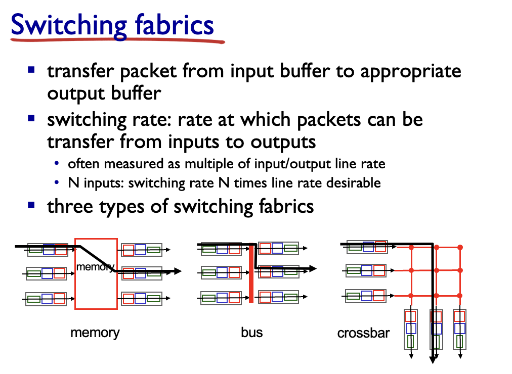

# 考点

网络层功能、作用、相关协议如何体现和实现这些功能

IP地址：IPV4，主机可用IP，子网掩码， CIDR ,默认网关

> 可能考design

什么是NAT网络地址转换，作用
**子网划分-好处，划分方法，划分过程，子网IP范围、掩码、网络地址、广播地址(也需要极其熟悉)**

> * (disign 大题) 比如给ip让人做子网划分*

路由协议 (概念,静态路由协议和动态路由协议) 简单了解OSPF和ICMP
路由表（直连、静态、动态（IGP与EGP相关协议）、SDN）
Dijkstra算法，算法描述，计算过程，计算目的（核心考点!） 路径距离是传输时延之类)

> DJ算法要画表   使用表格的形式一步一步推出算法  所以不能只理解算法还要会过程

SDN概念、目的、好处、架构构成

> 可能出论述

# 网络层

## 4.1 网络层概述

#### 1  网络层职能概览

* 网络层有两大核心职能：
  * **\*转发 (forwarding)\*** ——在每台路由器本地，把分组从输入端口送到恰当的输出端口；相当于“*过一次立交桥*”。
  * **\*路由 (routing)\*** ——在全网逻辑上，为分组规划从源到宿的整条路径；相当于“*规划整段旅程*”。实现方式是路由表

> * 这两种职能分别对应 **数据平面**（本地、纳秒级硬件）和 **控制平面**（网络范围、毫秒级软件 / SDN 控制器）。   前者是动作 后者是决策

### 网络层在协议栈中的角色

PPT 图示：传输层报文段进入网络层，被封装成 **IP 数据报**；到达接收端后再解封给传输层。路由器必须检查经过的 **所有 IP 首部字段**。**Chapter\_4\_V7.01 Network…**

* **接口 (interface)**：主机/路由器与物理链路的连接点，每个接口都要绑定一个 IP 地址。
* **\*主机 vs 路由器\***：主机通常 1–2 个接口；路由器多个接口并执行转发。

## 4.2 路由器

#### 4.2 路由器内部结构 (What’s Inside a Router)

### 1  总览图 —— 四大部件

PPT 首幅示意图给出了一台典型路由器的分层：输入端口、交换结构、输出端口、路由处理器。

* **输入端口 (input port)**：接收比特流并判定下一跳接口
* **交换结构 (switch fabric)**：把分组从某输入端口搬到目标输出端口
* **输出端口 (output port)**：缓存与排队，最终发送
* **路由处理器 (RP)**：运行控制平面代码（RIP/OSPF/BGP 或 SDN 代理）

---

### 2  输入端口工作流程


### 1. **Line Termination（物理层）**

* **功能**：完成物理层的比特级接收。

  * 接收来自物理链路的比特流。
  * 将比特流转换为帧，供数据链路层处理。

### 2. **Link Layer Protocol (Receive)（数据链路层）**

* **功能**：完成数据链路层的帧处理。

  * 解析帧头，提取数据包。
  * 检查帧的完整性（如校验和）。
  * 处理以太网协议等链路层协议。

### 3. **Lookup, Forwarding, Queueing（查找、转发和排队）**

* **功能**：
  1. **查找（Lookup）**：
     * 根据数据包的头部字段（如目的IP地址）查找转发表，确定数据包的输出端口。
  2. **转发（Forwarding）**：
     * 将数据包转发到交换结构（Switch Fabric），以便送往目标端口。
  3. **排队（Queueing）**：
     * 如果交换结构繁忙，数据包会暂时排队等待转发。

## 最长前缀匹配

## 什么是前缀？

### 1. **前缀的定义**

- **前缀**是IP地址的前几位，用于标识一个网络范围。
- 在转发表中，前缀用固定的位数表示，后面的位可以用通配符（`*`）表示。
- **前缀长度**：前缀中固定位的数量。例如：
  - `11001000 00010111 00010*** ********` 的前缀长度是 **21** 位。

### 2. **前缀在转发表中的作用**

- 转发表中的每一行定义了一个前缀范围。
- 路由器根据数据包的目的IP地址，匹配转发表中的前缀，找到最合适的转发接口。
- 如果多个前缀匹配，则选择**最长前缀**（匹配位数最多的前缀）。

#### 例题

##### 转发表


| **前缀（Destination Address Range）** | **前缀长度** | **Link Interface** |
| ------------------------------------- | ------------ | ------------------ |
| `11001000 00010111 00010*** ********` | 21位         | 0                  |
| `11001000 00010111 00011000 ********` | 24位         | 1                  |
| `11001000 00010111 00011*** ********` | 23位         | 2                  |
| **otherwise**                         | -            | 3                  |

---

### 示例1：目的地址 `DA = 11001000 00010111 00010110 10100001`

#### 匹配过程：

1. **与前缀1匹配**：

   - 前21位：`11001000 00010111 00010`，匹配成功。
   - 前缀长度：21位。
2. **与前缀2匹配**：

   - 前24位：`11001000 00010111 00011000`，不匹配。
3. **与前缀3匹配**：

   - 前23位：`11001000 00010111 00011`，不匹配。

#### 结果：

- 匹配到前缀1（21位），选择接口 **0**。

---

### 示例2：目的地址 `DA = 11001000 00010111 00011000 10101010`

#### 匹配过程：

1. **与前缀1匹配**：

   - 前21位：`11001000 00010111 00010`，匹配成功。
   - 前缀长度：21位。
2. **与前缀2匹配**：

   - 前24位：`11001000 00010111 00011000`，匹配成功。
   - 前缀长度：24位。
3. **与前缀3匹配**：

   - 前23位：`11001000 00010111 00011`，不匹配。

#### 结果：

- 匹配到前缀2（24位），选择接口 **1**。

---

### 交换结构的三种实现




| 方案                    | 工作原理                                         | 速率上限                                   | 优缺点 & 场景                                                                                                                  |
| ----------------------- | ------------------------------------------------ | ------------------------------------------ | ------------------------------------------------------------------------------------------------------------------------------ |
| **通过内存**            | CPU 把整包先读入系统 DRAM，再写出目标端口缓冲    | *≤ (link\_speed) × 2*（一次读 + 一次写） | 简单、成本低；受限于总线/DRAM 带宽，现仅见于软件交换机或低端 SOHO 路由器【PPT p57】**Chapter\_4\_V7.01 Network…**             |
| **共享总线**            | 各端口争用同一高速总线，分组带起首部指示目的端口 | *≈ 总线带宽*                              | 电路简单、易扩，但一旦端口数多/burst 流量高，总线成瓶颈；Cisco 5600（32 Gbps）曾采用【PPT p60】**Chapter\_4\_V7.01 Network…** |
| **交叉开关 (crossbar)** | N×N 非阻塞互连，每条输入可并行对接任一输出      | *≈ N × line rate*（理想状况）            | 性能最高；须做输入调度（匹配算法）防止冲突，硬件复杂、成本高；Cisco 12000、Juniper T1600 等核心路由器采用【PPT p61】           |

### 4  输出端口与排队 / 调度

* **缓存原因**：当交换结构涌入速率 > 链路发送速率。
* **排队策略**：
  * FIFO（先到先出）
  * Priority Queue（多队列优先级）
  * RR / WFQ（轮询、加权轮询）
* **缓冲大小经验**：RFC 3439 建议“带宽 × 典型 RTT”，后续研究指出 N 条并发流时可缩减到原来 1/√N。
* 
* 丢包可能发生在输入或输出缓冲溢出时——与拥塞控制协同触发重传。

---

## 4.3 IP协议

TCP是传输层协议IP是网络层协议

**IP协议**实现数据包的寻址与转发，

**路由协议**（如RIP、OSPF、BGP）负责路径选择

**ICMP协议**用于错误报告和路由器信号通信，共同完成数据在网络中的传输。

### IPV4数据报格式


> 开销是多少？
> 20 字节的 TCP
> 20 字节的 IP
> = 40 字节 + 应用程序层开销

### 4.3.2  分片与重组

* 若链路 MTU < TotalLen，路由器据 Flags/FragOffset 将数据报切成 8 B 对齐片；Offset 指片内相对位移，MF=0 表示最后一片。
* 仅 **最终宿主机** 重组，避免多跳重复聚散浪费资源。

1  关键名词定义

* **MTU (Maximum Transmission Unit)**
  指某条 **链路层** 能一次承载的 **最大帧长度**——IP 首部 + 数据负载都算在内。不同技术的 MTU 不同：FDDI 4352 B、Ethernet 1500 B、PPP-over-ADSL 1492 B、X.25 576 B 等**Chapter\_4\_V7.01 Network…**。
  > 路由器在把分组送入下一条链路前，先比对该链路 MTU；只要当前 IP 数据报 `Total Length > MTU`，就必须执行分片。
  >
* **Total Length**
  IPv4 首部中的 16 bit 字段，表示 **整份 IP 数据报（首部 + 数据）的字节数**。因此它的上限是 65 535 B，首部最短 20 B，实际数据最多 65 515 B（若没有选项）。字段由源主机生成，所有后续分片也会更新自己的 Total Length。 (字段列表见“IP datagram format”幻灯片)

---

### 4.3.3  IPv4 地址与子网

1. 32 bit 地址=“网络前缀 + 主机号”；同一网络前缀内主机无需路由即可通信。
2. **\*子网掩码\***：一串连续 1 后跟 0，用于提取网络前缀。
3. **\*CIDR\***(无类别域间路由) 记法 a.b.c.d/ x：x 位前缀；允许灵活聚合与分配。

   > 1. 是一种通过使用可变长度子网掩码（如 `/24`）来高效分配IP地址和聚合路由的技术。  CIDR是简单的记法便于看出子网掩码长度
   >
4. **\*主机可用 IP\***：去掉网络地址(全 0)与广播地址(全 1)，剩余 2^(主机位)-2 个。
5. **\*默认网关\***：主机 ARP 得到本局域内路由器 MAC，将目的不在本子网的数据报交给它转发。

---

### 前缀

`223.1.1.0/24` 中的 `/24` 表示子网掩码的前 **24位** 是网络部分，其余 **8位** 是主机部分。

* 例如：
  * `/24` → 子网掩码是 `255.255.255.0`（前24位是1）
  * `/16` → 子网掩码是 `255.255.0.0`（前16位是1）
  * `/8` → 子网掩码是 `255.0.0.0`（前8位是1）

### 为什么是 `/24`？

1. **IP地址的结构**

   - IPv4地址是一个32位的二进制数，分为两部分：
     - **网络部分**：标识子网
     - **主机部分**：标识子网内的具体设备
   - `/24` 表示前 **24位** 用于标识网络，后 **8位** 用于标识主机。
2. **子网掩码对应关系**

   - `/24` 对应的子网掩码是 `255.255.255.0`，即：
     ```
     11111111.11111111.11111111.00000000
     ```
   - 前 **24位** 是 `1`，表示网络部分；后 **8位** 是 `0`，表示主机部分。
3. **主机数量**

   - `/24` 的子网有 **8位主机位**，可分配的主机数量是：
     ```
     2^8 - 2 = 254（减去网络地址和广播地址）
     ```
4. **适用场景**

   - `/24` 常用于小型局域网，支持最多 **254台设备**。

---

### 总结

`223.1.1.0/24` 中的 `/24` 表示这是一个子网，网络部分占 **24位**，主机部分占 **8位**，适合用于支持 **254台主机** 的网络。4. **适用场景**

- `/24` 常用于小型局域网，支持最多 **254台设备**。

---

### 4.3.4  **\*子网划分\***（design topic）(考,重点!!!)


| 步骤                                  | 说明                                       | 示例（10.0.0.0/24 要划成 ≥6 个子网） |
| ------------------------------------- | ------------------------------------------ | ------------------------------------- |
| 明确需求                              | 目标子网数 n                               | n = 6                                 |
| 计算主机位                            | 找最小 k 使 2^k ≥ n                       | k = 3 → 借 3 位给网络号              |
| 定掩码                                | 原前缀 /24 → 新前缀 /27                   | **\*掩码\***= 255.255.255.224         |
| 列子网                                | 10.0.0.0/27, 10.0.0.32/27 … 10.0.0.224/27 | **\*子网 IP 范围\***                  |
| 给出**\*网络地址\***/**\*广播地址\*** | 如 10.0.0.0 与 10.0.0.31                   | –                                    |

> 好处：地址利用率高，隔离广播域；方法：按需借 host 位；过程：如上五步。考试常给出一个 /x 让你写所有子网。

---

### 4.3.5  动态主机配置 (DHCP)

Discover → Offer → Request → ACK 四报文交换，分配 IP、掩码、默认网关、DNS。

---

### 4.3.6  **\*NAT 网络地址转换\***

* 定义：边界路由器将私网〈内地址:端口〉映射到公网〈外地址:端口〉；维护转换表。
* 作用：节省 IPv4、公私隔离、会话保持；缺点：破坏端到端，P2P 穿透复杂。

---

### 4.3.7  IPv6 简介（非星标考点）

* 128 bit 地址，40 B 固定首部；取消首部校验和与分片字段。
* 地址压缩：去前导 0、:: 表示连续 0。
* 部署：隧道、双协议栈。

---

### 小结（只回顾已标星项）

* **\*IPv4 地址 / 子网掩码 / CIDR / 主机可用 IP / 默认网关\***
* **\*子网划分：好处、方法、过程、子网范围、掩码、网络地址、广播地址\***
* **\*NAT 网络地址转换：概念与作用\***

## 广义转发和SDN（软件定义网络）

### 1  传统“基于目的地址”的局限

* 在经典路由器里，输入端口 **只** 依据“目的 IP 前缀”做查表并选出输出端口（destination-based forwarding）。
* 现实需求却远不止如此：运营商希望按 IP＋端口实现防火墙、NAT 需要改写地址，负载均衡要按五元组分流……传统查表难以灵活应对。

---

### 2  Generalized Forwarding —— Match + Action 抽象

* PPT 把“转发”泛化为一条 **规则**：
  > Pattern（匹配字段集合） → Action（对匹配报文的处理）
  >
* Pattern 可同时匹配二层 MAC、三层 IP、四层 TCP/UDP 端口甚至 VLAN、MPLS；Action 可 **drop / forward / modify / 送控制器** 等。
* 结果是：同一套“\*匹配+动作\*”语法即可描述传统路由器、交换机、NAT、ACL、防火墙等多种设备逻辑。

---

### 3  **\*SDN概念\***

* *Software-Defined Networking* 将 **控制逻辑与数据转发彻底分离**：
  * 交换设备内部仅保留 **流表 (flow table)** 和必要的收、发、计数硬件；
  * 路由、策略等“脑力活”交由一个**逻辑上集中**的控制器统筹生成并下发。

---

### 4  **\*SDN目的\***

1. **解耦**：打破传统盒式设备“硬件＋封闭固件”束缚，让网络控制像软件升级一样灵活；
2. **集中视图**：网络状态与拓扑全局可见，便于统一流量工程与异常检测；
3. **开放接口**：南向（如 OpenFlow）与北向 API 使多厂商环境互通，方便第三方应用创新。

---

### 5  **\*SDN架构构成\***


| 层次         | 典型组件                            | 关键职责                                              |
| ------------ | ----------------------------------- | ----------------------------------------------------- |
| 数据平面     | 交换芯片、转发引擎、流表            | 按流表执行 Match+Action，实时转发报文                 |
| **控制平面** | **控制器**（ONOS、OpenDaylight 等） | 运行路由算法、策略模块，维护全网图，向交换机下发流表  |
| 南向接口     | OpenFlow、gNMI、P4Runtime           | 控制器↔交换机沟通：流表、计数器、事件上报            |
| 北向接口     | REST/gRPC API、Intent Framework     | 应用/编排系统调用，提出 QoS、ACL、安全、TE 等高层意图 |

> PPT 图示“逻辑集中控制平面”与本地 **CA (Control Agent)** 交互的三步箭头，正是此分层。

---

### 6  **\*SDN好处\***

1. **可编程**：网络行为由软件驱动，推出新协议或业务不再依赖硬件更换。
2. **灵活流量工程**：控制器可按全局最优计算路径、做负载均衡或快速故障绕转。
3. **多租户隔离**：轻松实现虚拟网络、细粒度安全策略；云数据中心尤其受益。
4. **运营成本低**：白盒交换机＋集中控制器的模式，避免厂商锁定。

---

### 7  OpenFlow 流表字段示例（补充理解，非星标）

* 条目包含：Pattern, Action, Priority, Counters。
* 例如 `src=1.2.*.*, dst=3.4.5.* → drop`；`dst=3.4.*.* → forward(2)` 等。
* Counters 统计字节／报文，可供控制器做监测、计费。

---

### 8  小结

* 先由 **Generalized Forwarding** 抽象定义“任何字段匹配 → 动作”，再以 **\*SDN\*** 实体化为“集中控制器 + 简单交换机”的新型架构。
* 牢记四条带星的考试要点：
  1. \*SDN概念\* 2. \*SDN目的\* 3. \*SDN架构构成\* 4. \*SDN好处\*
* 当试卷要求“论述 SDN 优势或画出架构图”时，可按“全局视图、可编程、开放接口”三句核心展开。


# 按照考点

## 网络层详解

网络层是OSI模型的**第3层**，负责数据包在不同网络间的路由和转发。

## 网络层的主要功能

### 1. 路径选择 (Routing)

**功能描述：**

- 确定数据包从源到目的地的最佳路径
- 在复杂网络拓扑中找到可达路径

**实现方式：**

```
路由表示例：
目标网络        下一跳        接口    跳数
192.168.1.0/24  192.168.2.1   eth0    1
10.0.0.0/8      192.168.2.2   eth1    2
0.0.0.0/0       192.168.2.1   eth0    1  ← 默认路由
```

### 2. 逻辑寻址 (Logical Addressing)

**功能描述：**

- 提供全局唯一的网络地址
- 支持层次化地址结构

**IP地址结构：**

```
IPv4: 192.168.1.100/24
网络部分: 192.168.1    主机部分: 100
子网掩码: 255.255.255.0 (/24)

IPv6: 2001:db8::1/64
网络前缀: 2001:db8::   接口标识: 1
```

### 3. 数据包转发 (Packet Forwarding)

**功能描述：**

- 根据目标IP地址转发数据包
- 处理数据包的生存时间(TTL)

**转发过程：**

```
1. 接收数据包
2. 检查目标IP地址
3. 查询路由表
4. 确定出接口和下一跳
5. 更新TTL值
6. 转发数据包
```

### 4. 分片与重组 (Fragmentation & Reassembly)

**功能描述：**

- 将大数据包分割成小片段
- 在目标主机重新组装

**分片示例：**

```
原始数据包: 1500字节
MTU限制: 576字节

分片结果:
片段1: 0-575字节   (MF=1, Offset=0)
片段2: 576-1151字节 (MF=1, Offset=72)
片段3: 1152-1499字节 (MF=0, Offset=144)
```

## 核心协议详解

### 1. IP协议 (Internet Protocol)

**IPv4报文格式：**

```
 0                   1                   2                   3
 0 1 2 3 4 5 6 7 8 9 0 1 2 3 4 5 6 7 8 9 0 1 2 3 4 5 6 7 8 9 0 1
+-+-+-+-+-+-+-+-+-+-+-+-+-+-+-+-+-+-+-+-+-+-+-+-+-+-+-+-+-+-+-+-+
|版本|首部长度|服务类型|          总长度                        |
+-+-+-+-+-+-+-+-+-+-+-+-+-+-+-+-+-+-+-+-+-+-+-+-+-+-+-+-+-+-+-+-+
|        标识                   |标志|      片偏移               |
+-+-+-+-+-+-+-+-+-+-+-+-+-+-+-+-+-+-+-+-+-+-+-+-+-+-+-+-+-+-+-+-+
|  生存时间     |    协议       |         首部校验和             |
+-+-+-+-+-+-+-+-+-+-+-+-+-+-+-+-+-+-+-+-+-+-+-+-+-+-+-+-+-+-+-+-+
|                        源IP地址                              |
+-+-+-+-+-+-+-+-+-+-+-+-+-+-+-+-+-+-+-+-+-+-+-+-+-+-+-+-+-+-+-+-+
|                      目标IP地址                              |
+-+-+-+-+-+-+-+-+-+-+-+-+-+-+-+-+-+-+-+-+-+-+-+-+-+-+-+-+-+-+-+-+
```

**关键字段作用：**

- **版本** - IP协议版本(4或6)
- **TTL** - 防止数据包无限循环
- **协议** - 上层协议类型(TCP=6, UDP=17)
- **源/目标IP** - 端到端通信标识

### 2. 路由协议

#### 距离向量协议 (RIP)

**工作原理：**

```python
# RIP路由更新伪代码
def rip_update():
    for neighbor in neighbors:
        for route in routing_table:
            if route.metric < 16:  # RIP最大跳数限制
                send_route_update(neighbor, route.destination, 
                                route.metric + 1)
```

**特点：**

- 以跳数为度量标准
- 最大跳数15（16表示不可达）
- 每30秒广播路由表

#### 链路状态协议 (OSPF)

**工作原理：**

```
1. 邻居发现 - Hello报文
2. 数据库同步 - LSA(链路状态通告)
3. 路径计算 - Dijkstra算法
4. 路由表更新
```

**OSPF区域概念：**

```
      Area 0 (骨干区域)
         |
    +----+----+
    |         |
  Area 1   Area 2
```

### 3. 辅助协议

#### ARP (地址解析协议)

**功能：** IP地址 → MAC地址

```
ARP请求: "谁是192.168.1.100？请告诉192.168.1.1"
ARP应答: "192.168.1.100在MAC地址aa:bb:cc:dd:ee:ff"
```

#### ICMP (互联网控制消息协议)

**功能：** 错误报告和网络诊断

```bash
# 常用ICMP工具
ping 8.8.8.8           # Echo Request/Reply
traceroute google.com  # Time Exceeded消息
```

**ICMP消息类型：**

- **Type 0** - Echo Reply (ping响应)
- **Type 3** - Destination Unreachable
- **Type 8** - Echo Request (ping请求)
- **Type 11** - Time Exceeded (TTL超时)

## 网络层设备

### 路由器 (Router)

**核心功能：**

```python
# 路由器数据包处理流程
def router_process_packet(packet):
    # 1. 接收数据包
    if not validate_checksum(packet):
        drop_packet(packet)
        return
  
    # 2. TTL处理
    packet.ttl -= 1
    if packet.ttl <= 0:
        send_icmp_time_exceeded()
        drop_packet(packet)
        return
  
    # 3. 路由查找
    next_hop = routing_table.lookup(packet.dest_ip)
    if not next_hop:
        send_icmp_unreachable()
        return
  
    # 4. 转发数据包
    forward_packet(packet, next_hop)
```

### 三层交换机

**特点：**

- 硬件加速的路由功能
- VLAN间路由
- 高性能数据包转发

## 实际应用场景

### 1. 企业网络路由

```
总部网络: 192.168.1.0/24
分支机构: 192.168.2.0/24
路由配置:
ip route 192.168.2.0 255.255.255.0 10.0.0.2
ip route 0.0.0.0 0.0.0.0 10.0.0.1  # 默认路由
```

### 2. 负载均衡路由

```
# 多路径负载均衡
ip route 0.0.0.0 0.0.0.0 192.168.1.1
ip route 0.0.0.0 0.0.0.0 192.168.1.2
```

### 3. 网络故障排查

```bash
# 路由追踪
traceroute -n 8.8.8.8

# 路由表查看
ip route show
netstat -rn
```

## 性能优化

### 路由优化策略

- **路由聚合** - 减少路由表大小
- **负载均衡** - 多路径分担流量
- **QoS** - 流量优先级控制

### 故障排除

```bash
# 常用诊断命令
ping -c 4 8.8.8.8           # 连通性测试
traceroute google.com       # 路径追踪
netstat -rn                 # 查看路由表
arp -a                      # 查看ARP缓存
```

## 总结

网络层通过**IP协议提供逻辑寻址**，**路由协议实现路径选择**，**ICMP协议支持错误控制**，共同实现了数据包在复杂网络环境中的可靠传输和转发，是互联网通信的核心层次。

找到具有 3 个许可证类型的类似代码
