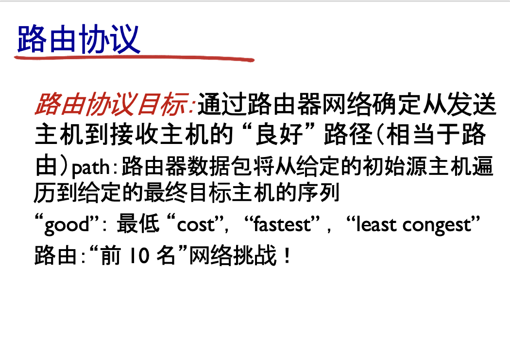

# 1 引言

基本是上个笔记的第一段  总之我们现在开始讲控制平面

数据平面传输 控制平面路由


## 5.2  路由协议与算法（PPT 5.2 逐页翻译＋讲解）

> 下面 **仅** 对你列出的考试要点加星号：
> **\*路由协议\*** **\*静态路由协议\*** **\*动态路由协议\*** **\*Dijkstra算法\*** **\*算法描述\*** **\*计算过程\*** **\*计算目的\***
> 引用均来自 *Chapter 5 V7.01 Network Layer – Control Plane* PPT

---

### 5.2.1  \*路由协议\* 分类框架



### 路由算法分类


| 视角     | 类别                     | 典型代表       | 适用范围          | PPT 位置 |
| -------- | ------------------------ | -------------- | ----------------- | -------- |
| 全局信息 | **Link-State (LS)**      | OSPF, IS-IS    | 中大型 AS 内      |          |
|          | **Distance-Vector (DV)** | RIP            | 小-中型           |          |
| 更新方式 | **\*静态路由协议\***     | 手工`ip route` | 小网、缺省路由    |          |
|          | **\*动态路由协议\***     | OSPF, RIP, BGP | 自治系统内部/之间 |          |

要点回顾：

* **静态**——人工配置、开销低、难扩展；
* **动态**——设备自动交换链路状态或距离向量，能随拓扑改变而**自收敛**。

---

### 5.2.2  Link-State 思想与 \*Dijkstra算法\*

1. **链路状态泛洪 (LS flooding)**：每台路由器把“邻居ID + 链路代价”封装成 LSA，多播给全网；所有节点最终拥有同一份拓扑图。
2. 在此全图上运行 **\*Dijkstra算法\*** 求“源 → 其他所有节点”的最短路树。

---

#### \*算法描述\*（PPT 伪代码翻译）

```
1  N'   ← {u}                    // 已确定最短路集合
2  for 每个节点 v
3      D(v) ← c(u,v)             // 初始化距离
4      p(v) ← u                  // 前驱
5  while N' ≠ 全体节点
6      取 w ∉ N' 使 D(w) 最小
7      N' ← N' ∪ {w}
8      for 每个 邻居 v of w
9          if D(v) > D(w)+c(w,v)
10             D(v) ← D(w)+c(w,v)
11             p(v) ← w
```

* `c(x,y)`：边 (x,y) 的**代价**，考试常用“链路传输时延”或“带宽倒数”。
* 复杂度 O(n²)，堆优化 O(n log n)。

---

#### \*计算过程\* —— 步骤表推导示例

> 下面用 PPT 提供的 7-节点网络（节点 a 为源，链路代价单位＝ms 传输时延）演示。


| Step | N′           | D(b),p | D(c),p | D(d),p | D(e),p | D(f),p | D(g),p |
| ---- | ------------- | ------ | ------ | ------ | ------ | ------ | ------ |
| 0    | {a}           | 2,a    | 5,a    | ∞     | 1,a    | ∞     | ∞     |
| 1    | {a,e}         | 2,a    | 4,e    | ∞     | —     | 7,e    | ∞     |
| 2    | {a,e,b}       | —     | 4,e    | 7,b    | —     | 7,e    | 11,b   |
| 3    | {a,e,b,c}     | —     | —     | 6,c    | —     | 7,e    | 10,c   |
| 4    | {a,e,b,c,d}   | —     | —     | —     | —     | 7,e    | 10,c   |
| 5    | {a,e,b,c,d,f} | —     | —     | —     | —     | —     | 10,c   |
| 6    | {a,…,g}      | 完成   |        |        |        |        |        |

* 每行对应伪代码第 6 行“选 w”一次；`D(v),p` 表“当前已知最短距离/前驱”。
* 最终得到最短路树，源 a 到 g 的路径为 a–e–c–g，总时延 10 ms。

---

#### \*计算目的\*

* 为**每**目的节点生成一条“总代价最小”路径，随后填入路由表 (FIB)。
* 代价可灵活定义：传输时延、丢包率、链路费用、甚至复合度量 → 满足不同 QoS 或流量工程需求。

---

### 5.2.3  Distance-Vector 概览（非星标，但需理解）

* 各节点仅存邻居距离表，周期性用 **Bellman-Ford** 公式更新：
  Dx(y)=min⁡v{c(x,v)+Dv(y)}D\_x(y)=\\min\_v \\bigl\\{ c(x,v)+D\_v(y) \\bigr\\}
* 优点：计算量小、报文短；缺陷：*count-to-infinity*、收敛慢（PPT 动画演示 44 轮）。

---

### 5.2.4  小结

* 静态 vs 动态、LS vs DV 是**分类维度**；
* 考试核心是 **\*Dijkstra算法\***：必须会写伪代码、画**表格**逐步推导，并说明“以**传输时延**等度量求最短路”这一 **\*计算目的\***。
* 下一节 5.3 将把 LS 协议 **OSPF** 落地到自治系统内部，继续关联路由表优先级等星标考点。

如需针对你的实际拓扑出题，或想练习 Bellman-Ford 更新过程，告诉我！
