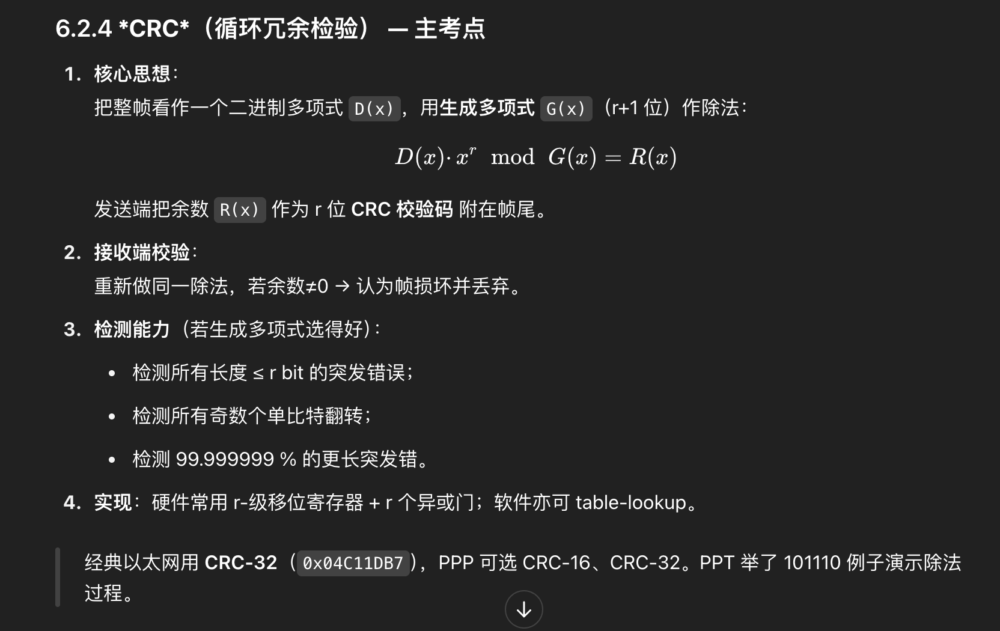

## 链路层：

下面简答或者选择:

TDMA/CDMA 信道划分协议 分时分码      CSMA

CRC 检测或校验数据传输或者保存后可能出现的错误 (大概了解)

链路层错误检验方法，错误纠正机制，实现方法
ARP作用、工作原理、工作过程、何时用 MAC地址
LAN , VLAN概念、目的、优点.

以太网.交换机.路由器和交换机什么时候用谁

MPLS指导数据报文和高速转发   --简单了解

# 链路层 本章似乎只出选择题

## 6.1  Link Layer 概览与核心服务

（对应 *Chapter 6 The Link Layer and LANs* 6.1 部分）

---

### 1  链路层在协议栈中的定位

* **位置**：位于网络层之下、物理层之上。
* **视角**：它只关心“一跳”——把 IP 数据报在相邻节点之间安全搬运；跨多跳端到端的事交给网络层。
* **实现**：几乎都在 **网卡/NIC** 芯片里完成（硬件 + 固件），所以延迟可做到微秒级。

---

### 2  链路层要解决的五件事


| 服务                 | 通俗理解                 | 典型场景                          |
| -------------------- | ------------------------ | --------------------------------- |
| **封装 Frame**       | 给上层数据“装箱贴标签” | 以太网帧包住 IP 数据报            |
| **介质接入**         | 在共享信道时协调谁先说话 | 旧式总线以太网、无线 LAN          |
| **可靠传输（可选）** | 在一跳内重传、确认       | PPP、HDLC                         |
| **差错检测/纠正**    | 在箱子外贴校验码         | CRC、Parity（将在 6.2 详解）      |
| **流量控制**         | 防止快端淹没慢端         | 以太网 PAUSE 帧、Wireless RTS/CTS |

> 注：考试清单中的 CRC、错误检验与 CSMA/TDMA 等属于后续小节 6.2–6.3 的重点，这里只是总览，不打 \*。

> half-duplex and full-duplex  with half duplex, nodes at both ends of link can transmit, but not at same time

### 3  “适配器”如何发送/接收帧

**发送端**

1. 从操作系统获得 IP 数据报 + 目的 **MAC 地址**；
2. 将其放入 NIC 的发送缓冲；
3. 加首部尾部（前导码、起始定界、CRC 等）；
4. 按所用链路协议的接入规则把比特串送上物理媒介。

**接收端**

1. 物理层恢复比特流；
2. 按帧格式提取首部，校验 CRC；
3. 若通过则把负载递交网络层；否则丢弃并可能请求重传（取决于协议）。

---

### 4  链路类型速览（为后续章节埋下概念）


| 分类             | 示例                          | 特征                     |
| ---------------- | ----------------------------- | ------------------------ |
| **点到点 (P2P)** | PPP、HDLC、点对点光纤         | 无争用，简单             |
| **广播**         | 传统 Coax Ethernet、Wi-Fi     | 需多路访问协议 (6.3)     |
| **有线 vs 无线** | 以太网、DOCSIS ↔ 802.11、LTE | 误码率、介质接入方式不同 |
| **局域 vs 广域** | LAN、VLAN ↔ MPLS 虚电路      | 范围/规划方式差异        |

---

### 5  本节小结

* 链路层负责“一跳之内”的封装、接入、可靠/差错与流控。
* 其所有功能最终体现在 **帧格式** + **接入算法** + **NIC 硬件** 中。
* 接下来的小节将逐一深入：
  * 6.2 差错检测与 \*CRC\* 等考点；
  * 6.3 \*CSMA\*、\*TDMA/CDMA\* 等多路访问；
  * 6.4 \*ARP/MAC\*、\*LAN & VLAN\*、以太网与交换机；
  * 6.5 \*MPLS\* 高速转发。

## 6.2  差错检测与纠正

（PPT 6.2 对应页逐页翻译＋讲解）

---

### 6.2.1  差错为何出现？

* 有线链路的热噪声、无线链路的多径与干扰，都会使 0/1 翻转。误码率虽只有 10-6 ～ 10-10，但千兆链路每秒就传亿级比特，必须防护。
* “差错控制”分两步：
  1. **\*错误检验方法\*** ——发现帧损坏；
  2. **\*错误纠正机制\*** ——要么本地修复，要么让上一层重传。

---

### 6.2.2  最简单：奇偶校验 (Parity)


| 方案            | 步骤                                              | 检测能力                           |
| --------------- | ------------------------------------------------- | ---------------------------------- |
| 单比特奇/偶校验 | 在每 7 bit 数据后添 1 bit，使 1 的个数成为奇/偶数 | 只能查出奇数个翻转                 |
| 二维奇偶        | 先按行再按列加校验 bit                            | 检测 2 bit 错、定位并纠正 1 bit 错 |

硬件实现只需异或门；今天常用在 UART、RAM 条。

---

### 6.2.3  Internet Checksum

* 把数据按 16 bit 分段做 **一补和**，末尾再取一补；UDP/TCP 头部都用它。
* 优点：软件容易；缺点：对某些位翻转（等值补偿）无感，检测率不及 CRC。

---

### 6.2.4  **\*CRC\*（循环冗余检验）** — 主考点

1. **

---

### 6.2.5  **\*错误纠正机制\*** — 检测之后怎么办？


| 思路             | 链路层常见做法                                   | 代表协议                                  |
| ---------------- | ------------------------------------------------ | ----------------------------------------- |
| **ARQ 重传**   | 发现错即丢帧，并请求上层或对端重发；简单但需反馈 | PPP (Stop-&-Wait)、802.11 ACK             |
| **FEC 前向纠错** | 发送端添冗余，接收端可自行修复一定位错           | 光纤 FEC (Reed–Solomon)、卫星 Turbo/LDPC |
| **混合 HARQ**    | 先尝试 FEC，若仍失败再 ARQ 重传                  | LTE 无线链路                              |

链路层大多采用 “CRC + ARQ”；广域长时延或高 BER 信道（卫星、光传送网）才会上 FEC。

---

### 6.2.6  对比与选型小结


| 方法             | 冗余开销      | 硬件复杂度 | 检测/纠正特性                   |
| ---------------- | ------------- | ---------- | ------------------------------- |
| 奇偶             | 1 bit / 字节  | 极低       | 检测偶/奇数错，纠 1 bit（二维） |
| Checksum         | 16 bit / 报文 | 低         | 中等检测率，无法纠错            |
| **\*CRC\***      | r bit / 帧    | 中         | 高检测率，常与 ARQ 搭配         |
| FEC (RS/Hamming) | 成倍冗余      | 高         | 可直接纠正，适合高 BER          |

* **考场记忆**：**“MAC 帧用 CRC-32，PPP/Wi-Fi 用 CRC-16/32”**；CRC 能检测突发差错，真正纠错一般靠重传。
* 设计题若要求“给定 `G(x)=1011` 计算 CRC”→ 按 PPT 例子落笔即可。

---

## 6.3  Multiple-Access Protocols —— 当多台节点共用同一条广播信道

（翻译自 PPT 6.3，并仅在你的考点 **TDMA / CDMA / CSMA** 处加 \*\*\*）

---

### 6.3.1  问题背景

* **广播信道**：一根同轴电缆、一段 Wi-Fi 频道、卫星上行链路……任何时刻只能有 **一个** 发射端真正占用介质。
* **冲突**：若两节点同时发，信号相互叠加就毁帧，必须重发——效率大降。
* 目标：设计 **介质接入协议 (MAC protocol)**，让所有节点公平、高效地“轮流说话”。

---

### 6.3.2  三大类 MAC 协议总览


| 类别         | 核心思路                       | 代表                                  | 适用场景         |
| ------------ | ------------------------------ | ------------------------------------- | ---------------- |
| **信道划分** | 先把“资源大块”切细分给每人   | **\*TDMA\***、FDMA、**\*CDMA\***      | 电话网、蜂窝上行 |
| **随机接入** | 任何时刻都可尝试发，冲突后重来 | **\*CSMA\***、ALOHA、CSMA/CD、CSMA/CA | 以太网、Wi-Fi    |
| **轮流制**   | 明确“谁先谁后”令牌/轮询      | Token Ring, Polling                   | 低速工业总线     |

---

## 6.3.A  *TDMA*（Time-Division Multiple Access）


| 要点      | 说明                                                        |
| --------- | ----------------------------------------------------------- |
| **核心**  | 把总带宽按“时间片”分成 N 个等长时隙；节点 i 只在隙 i 发。 |
| 同步      | 所有节点共享时钟分界线；卫星、蜂窝基站负责下发同步信标。    |
| 延迟/效率 | **无冲突**，空闲时隙会浪费；若流量不均衡，效率低。          |
| 公式      | 信道利用率 = 在用隙 / 总隙（高峰满载时可达 100 %）          |
| 课本示例  | 4 节点、125 µs/隙，帧长 1 ms → 每节点得 2 Mbps 固定带宽。 |

---

## 6.3.B  *CDMA*（Code-Division Multiple Access）


| 要点     | 说明                                                                                               |
| -------- | -------------------------------------------------------------------------------------------------- |
| **核心** | 每节点与众不同的“扩频码” ⟶ 同频同时间也能并发；接收端用相关运算“解码自己”。                   |
| 码字     | 正交或伪随机序列（长度 m）；比特**扩频**为 m chip → 带宽放大 m 倍。                               |
| 抗干扰   | 码序列互相关接近 0 → 天然抗窃听、抗窄带干扰；军用、蜂窝上行曾广用。                               |
| 帧同步   | 需精确码相位；复杂度高于 TDMA/FDMA。                                                               |
| 课堂直观 | 把教室喻作广播介质：每人说相同音量英语句子但配上专属节拍，老师只听“大鼓点”节拍就能提取一人信息。 |

> PPT 以 4-chip Walsh 码举例展示“发送 1101、收到经多址叠加后如何相关分离”。

---

## 6.3.C  *CSMA*（Carrier-Sense Multiple Access）


| 版本                     | 规则                                                   | 目的               |
| ------------------------ | ------------------------------------------------------ | ------------------ |
| **1. 非持有 CSMA**       | 若检测到信道忙 → 随机退避再听                         | 减少碰撞再复发     |
| **2. 1-持有 CSMA**       | 信道忙就持续监听，占闲立即发                           | 稍增效率           |
| **3. CSMA/CD**（以太网） | 边发边监听，发现碰撞立即发*jam*& 二进制指数退避        | 有线半双工冲突检测 |
| **4. CSMA/CA**（Wi-Fi）  | 无法检测碰撞 → 发送前随机倒计时；RTS/CTS 解决隐藏节点 | 无线半双工避免冲突 |


| 技术     | 主要应用      | 优点             | 缺点               |
| -------- | ------------- | ---------------- | ------------------ |
| **TDMA** | GSM、卫星通信 | 无冲突、公平性好 | 需要同步、延迟固定 |
| **CDMA** | 3G移动通信    | 容量大、抗干扰   | 复杂度高、功率控制 |
| **CSMA** | 以太网、WiFi  | 简单、灵活       | 有冲突、效率可变   |

## 关键区别

* **TDMA**：**时间**分离
* **CDMA**：**编码**分离
* **CSMA**：**竞争**访问

---

### 6.3.3  类间优缺点评价


| 指标       | *TDMA*           | *CDMA*                   | *CSMA*       |
| ---------- | ---------------- | ------------------------ | ------------ |
| 冲突       | 无               | “码域”分离，逻辑无冲突 | 有，需退避   |
| 空闲浪费   | 有（若隙无人发） | 无                       | 无           |
| 硬件复杂度 | 中               | 高（扩频/解扩）          | 低           |
| 同步需求   | 高               | 最高                     | 低           |
| 高峰公平   | 天然平等         | 视功率控制               | 退避可能饿死 |

---

### 6.3.4  典型应用对号入座

* **蜂窝上行 (3 G)**：曾以 *CDMA*（IS-95, W-CDMA）为主；4 G 之后统一 OFDMA。
* **卫星 TDMA**：每地面站固定时隙避免长 RTT 引致冲突。
* **有线 10BASE-T Hub 网络**：半双工 + *CSMA/CD*。
* **现代交换式以太网**：点对点全双工——**不再需要 CSMA**。
* **Wi-Fi**：依旧共享空口 ⇒ *CSMA/CA* + ACK。

---

### 6.3.5  小结（星号回顾）

* **\*TDMA\***：按时隙静态分配，零碰撞 → 频道利用率取决于业务均衡度。
* **\*CDMA\***：用正交 PN 码把“用户”搬到码域，理论“同时同频”；硬件与功控更复杂。
* **\*CSMA\***：先听后发，现实 LAN/WLAN 通用随机接入；有线可冲突检测 (CD)，无线靠冲突避免 (CA)。

若需看 CSMA/CD 二进制退避过程示意，或动手计算 TDMA 带宽分配，随时告诉我！

## 6.4  Link-Layer Addressing, ARP, Ethernet, Switches & VLANs

（对应 *Chapter-6 The Link Layer and LANs* PPT 6.4 页）

---

### 6.4.1  MAC 地址——局域网里的“身份证”

* 48 bit（6 byte）十六进制写法，全球唯一，由 IEEE 分配给网卡厂家。
* 只在 **本地链路** 生效；跨越路由器后就会换成下一跳链路上的 MAC。
* 目的：让链路层硬件能够在 **微秒级** 用硬件表（或学习表）完成帧转发。

---

## ARP (地址解析协议) 详解

### ARP的作用

**主要功能：**

- **IP地址转换为MAC地址** - 将网络层地址映射到数据链路层地址
- **维护地址映射表** - 缓存IP-MAC对应关系
- **支持本地网络通信** - 使数据能在同一网段内正确传输

**解决的问题：**

```
网络通信中的地址问题：
应用层 → 知道目标主机名或IP地址
网络层 → 使用IP地址路由
数据链路层 → 需要MAC地址进行实际传输
物理层 → 基于MAC地址的硬件寻址
```

### ARP工作原理

**基本原理：**

```
已知条件：目标IP地址
需要获得：对应的MAC地址
解决方法：广播询问 + 单播回复
```

**核心机制：**

- **广播查询** - 向本地网段所有设备询问
- **单播回复** - 目标设备直接回复自己的MAC地址
- **缓存机制** - 保存学习到的IP-MAC映射关系

### ARP工作过程

#### 完整的ARP解析过程

**场景：** 主机A (192.168.1.10) 要与主机B (192.168.1.20) 通信

**步骤1：检查ARP缓存**

```
主机A首先检查本地ARP表：
arp -a 或 ip neighbor show

如果找到192.168.1.20的MAC地址 → 直接使用
如果没有找到 → 启动ARP请求过程
```

**步骤2：发送ARP请求**

```
ARP请求报文内容：
+------------------+------------------+
| 源MAC地址        | AA:BB:CC:DD:EE:FF|
| 目标MAC地址      | FF:FF:FF:FF:FF:FF| (广播)
| 源IP地址         | 192.168.1.10     |
| 目标IP地址       | 192.168.1.20     |
| 操作类型         | 请求 (1)         |
+------------------+------------------+

广播到整个局域网段
```

**步骤3：网段内所有设备接收**

```
交换机处理：
- 接收ARP广播帧
- 转发到所有端口（除源端口外）
- 学习源MAC地址

各主机处理：
- 检查目标IP是否是自己
- 不是自己 → 忽略该请求
- 是自己 → 准备ARP回复
```

**步骤4：目标主机回复**

```
主机B (192.168.1.20) 的ARP回复：
+------------------+------------------+
| 源MAC地址        | 11:22:33:44:55:66|
| 目标MAC地址      | AA:BB:CC:DD:EE:FF| (单播)
| 源IP地址         | 192.168.1.20     |
| 目标IP地址       | 192.168.1.10     |
| 操作类型         | 回复 (2)         |
+------------------+------------------+

直接单播发送给主机A
```

**步骤5：更新ARP缓存**

```
主机A接收到ARP回复后：
1. 验证回复的有效性
2. 更新本地ARP表
3. 开始正常的数据通信

ARP表项示例：
IP地址         MAC地址           类型    过期时间
192.168.1.20   11:22:33:44:55:66 动态   300秒
```

### ARP报文格式

**详细报文结构：**

```
 0                   1                   2                   3
 0 1 2 3 4 5 6 7 8 9 0 1 2 3 4 5 6 7 8 9 0 1 2 3 4 5 6 7 8 9 0 1
+-+-+-+-+-+-+-+-+-+-+-+-+-+-+-+-+-+-+-+-+-+-+-+-+-+-+-+-+-+-+-+-+
|    硬件类型(2)               |    协议类型(2)               |
+-+-+-+-+-+-+-+-+-+-+-+-+-+-+-+-+-+-+-+-+-+-+-+-+-+-+-+-+-+-+-+-+
| 硬件地址长度  | 协议地址长度  |         操作码(2)            |
+-+-+-+-+-+-+-+-+-+-+-+-+-+-+-+-+-+-+-+-+-+-+-+-+-+-+-+-+-+-+-+-+
|                    发送方硬件地址 (6字节)                     |
+-+-+-+-+-+-+-+-+-+-+-+-+-+-+-+-+-+-+-+-+-+-+-+-+-+-+-+-+-+-+-+-+
|     发送方硬件地址    |       发送方协议地址 (4字节)          |
+-+-+-+-+-+-+-+-+-+-+-+-+-+-+-+-+-+-+-+-+-+-+-+-+-+-+-+-+-+-+-+-+
|  发送方协议地址       |       目标硬件地址 (6字节)           |
+-+-+-+-+-+-+-+-+-+-+-+-+-+-+-+-+-+-+-+-+-+-+-+-+-+-+-+-+-+-+-+-+
|                    目标硬件地址                              |
+-+-+-+-+-+-+-+-+-+-+-+-+-+-+-+-+-+-+-+-+-+-+-+-+-+-+-+-+-+-+-+-+
|                    目标协议地址 (4字节)                      |
+-+-+-+-+-+-+-+-+-+-+-+-+-+-+-+-+-+-+-+-+-+-+-+-+-+-+-+-+-+-+-+-+
```

**字段说明：**

- **硬件类型**: 1 (以太网)
- **协议类型**: 0x0800 (IPv4)
- **操作码**: 1 (请求), 2 (回复)

### 何时使用MAC地址

#### 1. 本地网络通信

```
同一局域网内通信：
源主机 → 直接使用目标主机MAC地址 → 目标主机

示例：
192.168.1.10 → 192.168.1.20
使用192.168.1.20对应的MAC地址
```

#### 2. 跨网络通信

```
不同网段通信：
源主机 → 使用网关MAC地址 → 网关路由器 → 目标网络

示例：
192.168.1.10 → 10.0.0.5
使用网关192.168.1.1的MAC地址
```

#### 3. 数据帧封装

```
以太网帧结构：
+--------+--------+------+--------+-----+
|目标MAC |源MAC  |类型  | 数据   |FCS |
+--------+--------+------+--------+-----+
|6字节   |6字节  |2字节 |46-1500 |4字节|

MAC地址决定帧的最终去向
```

## LAN (局域网) 详解

### LAN基本概念

**定义：**
LAN (Local Area Network) 是在有限地理范围内（如办公室、建筑物、校园）连接多台计算机和网络设备的计算机网络。

**特点：**

```
地理范围：通常几百米到几公里
传输速度：高速（10Mbps到10Gbps+）
覆盖区域：单一建筑物或园区
所有权：通常属于单一组织
延迟：极低延迟
错误率：很低的误码率
```

**典型LAN拓扑：**

- **星形拓扑** - 所有设备连接到中央交换机
- **总线拓扑** - 所有设备共享一条传输介质（较少使用）
- **环形拓扑** - 设备形成闭合环路（令牌环网络）

## VLAN (虚拟局域网) 详解

### VLAN概念

**定义：**
VLAN (Virtual Local Area Network) 是通过软件在物理网络上创建的逻辑网络分段，将一个物理LAN划分为多个虚拟的广播域。

**核心特点：**

```
逻辑划分：基于软件配置而非物理连接
广播域隔离：不同VLAN间默认不能直接通信
灵活管理：可跨越多个物理交换机
动态调整：可随时修改VLAN配置
```

### VLAN的目的

#### 1. 网络分段和隔离

```
部门隔离：
VLAN 10 → 财务部门
VLAN 20 → 技术部门  
VLAN 30 → 销售部门
VLAN 40 → 访客网络

每个部门独立的广播域，提高安全性
```

#### 2. 提高网络性能

```
减少广播风暴：
- 限制广播域大小
- 减少不必要的网络流量
- 提高整体网络性能
```

#### 3. 增强安全性

```
网络安全控制：
- 逻辑隔离敏感数据
- 控制部门间访问权限
- 防止未授权访问
```

#### 4. 简化网络管理

```
集中管理：
- 统一VLAN策略配置
- 灵活的用户分组
- 便于故障排除和监控
```

### VLAN的优点

#### 1. 成本效益

```
✅ 减少物理设备需求
✅ 降低布线成本
✅ 提高现有设备利用率
✅ 减少网络维护开销
```

#### 2. 管理灵活性

```
✅ 用户可跨物理位置加入同一VLAN
✅ 无需重新布线即可调整网络结构
✅ 支持远程管理和配置
✅ 便于网络扩展和重组
```

#### 3. 安全性提升

```
✅ 逻辑隔离不同用户组
✅ 控制VLAN间通信
✅ 支持精细的访问控制策略
✅ 减少安全攻击面
```

#### 4. 性能优化

```
✅ 减少广播流量
✅ 提高网络带宽利用率
✅ 降低网络拥塞
✅ 改善应用响应时间
```

### VLAN实现方式

#### 1. 基于端口的VLAN

```
配置示例：
交换机端口1-8  → VLAN 10 (财务部)
交换机端口9-16 → VLAN 20 (技术部)
交换机端口17-24 → VLAN 30 (销售部)

特点：简单易管理，最常用
```

#### 2. 基于MAC地址的VLAN

```
根据设备MAC地址分配VLAN：
MAC: 00:11:22:33:44:55 → VLAN 10
MAC: AA:BB:CC:DD:EE:FF → VLAN 20

特点：设备移动时VLAN不变
```

#### 3. 基于协议的VLAN

```
根据网络协议分配：
IP协议流量 → VLAN 10
IPX协议流量 → VLAN 20

特点：适合多协议环境
```

```css
没有Trunk的情况：
交换机A ═══ 交换机B
   │           │
VLAN10      VLAN10
VLAN20      VLAN20

需要为每个VLAN单独连线 → 浪费端口资源

有Trunk的情况：
交换机A ═══[Trunk]═══ 交换机B
   │                    │
VLAN10,20            VLAN10,20

一条链路承载多个VLAN → 节省端口资源
```

## 以太网详解

### 以太网概念

**定义：**
以太网是一种局域网技术，定**义了物理层和数据链路层的标准**，是目前最广泛使用的LAN技术。

> 以太网定义了物理层和数据链路层的标准!!

**标准演进：**

```
10BASE-T:    10 Mbps    双绞线
100BASE-TX:  100 Mbps   快速以太网
1000BASE-T:  1 Gbps     千兆以太网
10GBASE-T:   10 Gbps    万兆以太网
40GbE/100GbE: 40/100 Gbps 数据中心应用
```

### 以太网帧结构

```
+----------+----------+------+--------+-----+
|目标MAC   |源MAC    |类型  | 数据   |FCS  |
|6字节     |6字节    |2字节 |46-1500 |4字节|
+----------+----------+------+--------+-----+

前导码: 8字节 (用于同步)
目标MAC: 目标设备的硬件地址
源MAC: 发送设备的硬件地址  
类型: 上层协议类型
数据: 实际传输的数据
FCS: 帧校验序列
```

## 交换机详解

### 交换机功能

**核心功能：**

```
1. MAC地址学习
   - 学习源MAC地址和端口的对应关系
   - 建立和维护MAC地址表

2. 帧转发决策
   - 根据目标MAC地址查找转发端口
   - 单播、组播、广播帧的不同处理

3. 冲突域分隔
   - 每个端口是独立的冲突域
   - 全双工通信，无冲突

4. VLAN支持
   - 创建和管理虚拟局域网
   - VLAN间隔离和标记
```

### 交换机类型

#### 1. 非管理型交换机

```
特点：
- 即插即用，无需配置
- 价格便宜
- 功能简单

适用：家庭网络、小型办公室
```

#### 2. 管理型交换机

```
特点：
- 支持VLAN配置
- 支持QoS、链路聚合
- 支持SNMP管理
- 提供命令行和Web界面

适用：企业网络、数据中心
```

#### 3. 三层交换机 (就是有网络层)

```
特点：
- 具备路由功能
- 支持VLAN间路由
- 硬件转发，高性能

适用：核心网络、大型企业
```

## 路由器 vs 交换机使用场景

### 何时使用交换机

#### 1. 同一网段内连接

```
场景：
- 连接同一VLAN内的设备
- 提供局域网内的高速连接
- 扩展网络端口数量

示例：
办公室内多台电脑连接到同一个192.168.1.0/24网段
```

#### 2. VLAN创建和管理

```
需求：
- 需要逻辑分隔网络
- 部门间网络隔离
- 提高网络安全性

应用：
企业网络中按部门创建不同VLAN
```

#### 3. 高密度端口需求

```
场景：
- 需要大量网络端口
- 接入层设备连接
- 服务器机房布线

特点：
24口、48口交换机提供高密度连接
```

### 何时使用路由器

#### 1. 跨网段通信

```
场景：
- 连接不同IP网段
- VLAN间路由
- 连接不同地理位置的网络

示例：
总部网络(192.168.1.0/24) ↔ 分公司网络(192.168.2.0/24)
```

#### 2. 互联网接入

```
功能：
- 连接到ISP
- NAT地址转换
- 防火墙功能

应用：
企业网络接入互联网的网关设备
```

#### 3. WAN连接

```
场景：
- 连接远程站点
- VPN隧道建立
- 专线连接

技术：
Frame Relay、MPLS、VPN
```

#### 4. 复杂路由需求

```
功能：
- 运行动态路由协议
- 路径选择和优化
- 负载均衡

应用：
大型网络的核心路由设备
```

### 设备选择决策表

```
需求场景                    推荐设备        原因
-------------------------------------------------
同网段设备连接             交换机          二层转发，高效
不同网段互通               路由器          三层路由功能
创建VLAN                  管理型交换机     VLAN管理功能
互联网接入                路由器          NAT、防火墙
高密度接入                交换机          提供大量端口
VLAN间路由               三层交换机       硬件路由性能
远程站点连接              路由器          WAN接口支持
数据中心核心              三层交换机       高性能、低延迟
```

### 典型网络架构

#### 三层网络架构

```
核心层 (Core):
- 高性能三层交换机或路由器
- 提供快速传输和冗余

汇聚层 (Distribution):  
- 三层交换机
- VLAN间路由、策略控制

接入层 (Access):
- 二层交换机
- 终端设备接入、VLAN分配
```

#### 小型网络架构

```
互联网
    |
[路由器] ← 网关功能、NAT
    |
[核心交换机] ← VLAN管理、三层路由
    |
[接入交换机] ← 设备连接
    |
终端设备
```

### 6.4.5  **\*路由器还是交换机？什么时候用谁？\***


| 场景                                        | 推荐设备                          | 原因                                      |
| ------------------------------------------- | --------------------------------- | ----------------------------------------- |
| 同一**VLAN/LAN**内二层转发                  | **\*交换机\***                    | 速度快（ASIC 线速）、成本低、无需 IP 分段 |
| 不同**子网 / VLAN**互通                     | **\*路由器** *或*三层交换机\*\*\* | 需要查看 IP 首部并重新选路；可做 NAT、ACL |
| 大二层环网易环路                            | **路由器**（或启用 STP/RSTP）     | 三层分段天然无广播风暴；二层需生成树防环  |
| 需策略路由、QoS、VPN                        | 路由器                            | 更丰富的控制平面、报文改写功能            |
| 纯局域高速东-西流量（数据中心 Top-of-Rack） | 交换机                            | 延迟纳秒级、端口密度高                    |

> **口诀**
>
> * **“同网段靠交换机，跨网段找路由”**
> * 若要进/出互联网 ➟ 必经路由器（做 NAT、BGP …）。

---

交换机的二层转发

1. 接收帧
   ↓
2. 学习源MAC（A选项）
   ↓
3. 查找目的MAC
   ↓
4. 找到匹配？
   ├─ 否 → VLAN内泛洪（C选项）
   └─ 是 → 检查VLAN
   ├─ 不同VLAN → 丢弃（B选项）
   └─ 同VLAN → 检查端口
   ├─ 相同端口 → 丢弃（D选项）
   └─ 不同端口 → 转发（D选项）

### 6.5 MPLS —— 三段话速记（★考点：指导数据报文并实现高速转发）

1. **一张“快递单”**
   MPLS 在 IP 头和链路层头之间插入 **20 bit Label**。入口 LER push，沿途 LSR swap，出口 pop——查表键永远是〈入端口, Label〉，**定长**、**硬件流水线**，比最长前缀匹配快得多。
2. **流量工程 & VPN**
   控制器/路由器可显式把不同业务贴上不同 Label，走指定 LSP；遇故障仅需几毫秒换 Label 就能绕路。再叠一层 Label 就能把多家客户“隔离”跑在同一骨干。
3. **“混血”优势**
   上承任何三层协议（“Multi-Protocol”），下保以太硬件速度：**高速转发 + 策略弹性**——这正是卷面常问的 MPLS 精髓。

---

## 6.7 A Day in the Life of a Web Request（一次网页请求的全链路旅程）

> PPT 用时间线串起整个协议栈，这里按发生顺序快速过一遍。

1. **启动阶段**
   * **DHCP** 发现 + Offer → 获得本机 IP、子网掩码、默认网关。
   * 可选 **NAT** 配置：私网地址映射到公网地址:端口。
2. **解析域名**
   * 浏览器查本机 DNS 缓存 → 若无，向递归解析器发 **UDP 53** 查询；缓存 TTL 几分钟到一小时。
3. **TCP 握手 & TLS**
   * 3-way handshake（SYN, SYN-ACK, ACK），若使用 HTTPS 立即进入 TLS ClientHello → ServerHello 授权、密钥协商。
4. **HTTP**
   * HTTP/2 或 HTTP/3 请求：头压缩 + 多路复用；服务器返回 HTML/CSS/JS。
5. **链路-层幕后**
   * 每个新目的地先走 **ARP** 找到网关 MAC；帧进入交换式以太网（全双工，无 CSMA）→ 出口路由器。
   * 若骨干部署 **MPLS / 数据中心 Fabric**，数据报被打 Label、在 Clos 网络里做 ECMP。
6. **回程**
   * 服务器到客户端反向路径通常因 BGP “热土豆”择最近出口。TTL 递减，若为诊断可看到 **ICMP 11/0**。
7. **收尾**
   * 浏览器渲染完成后，TCP 进入 TIME\_WAIT；DNS、ARP 项目最终根据超时清理。

**思维导图式记忆**

```
DHCP → ARP → TCP 3WH / TLS → HTTP → (MPLS / ECMP) → ICMP 可视化 → FIN
```

整条链路把你在本章学到的 **MAC-ARP-交换机-VLAN-MPLS** 与前几章的 **TCP, DNS, HTTP, SDN** 全部串联，可用作期末“综合论述”模板。

---

### 一页速览：本章所有★考点


| 章节 | 星号考点                          |
| ---- | --------------------------------- |
| 6.2  | CRC、差错检测/纠正方法            |
| 6.3  | TDMA/CDMA、CSMA                   |
| 6.4  | ARP；LAN & VLAN；交换机 vs 路由器 |
| 6.5  | MPLS：数据报指导 & 高速转发       |

> 6.6 与 6.7 主要用于综合理解，通常出 “简述数据中心拓扑优势” 或 “按时间线描述一次网页请求” 类型题。掌握上表即可覆盖必考点。

如需练习题、Wireshark 抓包或画 Clos-Fabric 拓扑示意，请告诉我！
