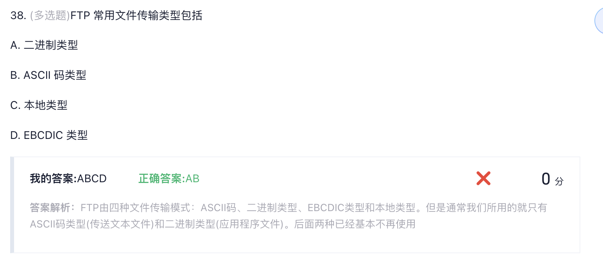
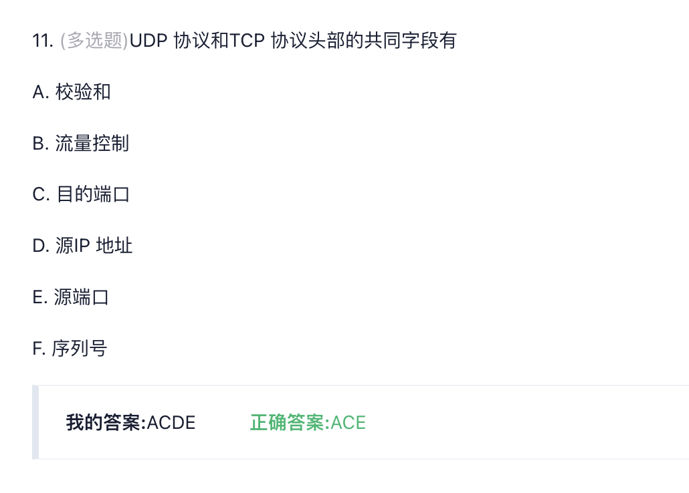
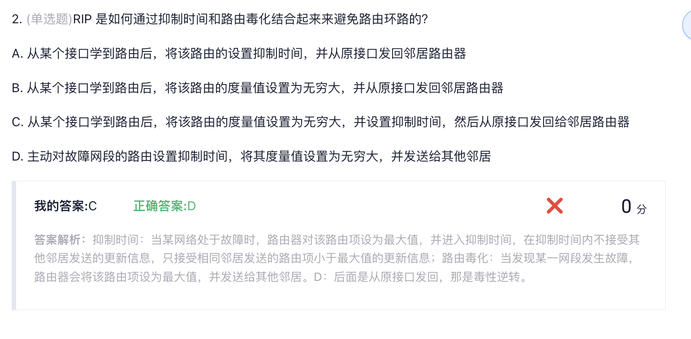
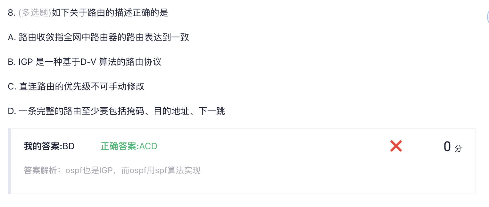
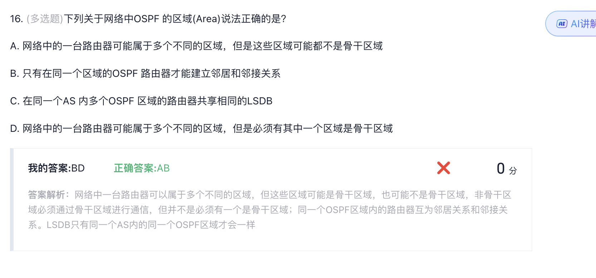

**B. OSI 参考模型是对发生在网络设备间的信息传输过程的一种理论化描述，并且定义了如何通过硬件和软件实现每一层功能**

❌ **这个说法是错误的**。

**错误之处在于**：

* OSI参考模型确实是对网络通信过程的理论化描述 ✅
* 但是，OSI模型**只定义了每一层应该做什么（功能规范）**，而**并不定义如何具体实现**


### 30. **(单选题)**DHCP 客户端向DHCP 服务器发送（）报文进行IP 租约的更新？

* A. DHCP Request
* B. DHCP Release
* C. DHCP Decline
* D. DHCP Inform

*我的答案:*D**:DHCP Inform;***正确答案:*A**:DHCP Request;**






## 第11题：私有地址识别

**私有地址的标准范围**（RFC 1918定义）：

- **A类私有地址**：`10.0.0.0/8` （10.0.0.0 ~ 10.255.255.255）
- **B类私有地址**：`172.16.0.0/12` （172.16.0.0 ~ 172.31.255.255）
- **C类私有地址**：`192.168.0.0/16` （192.168.0.0 ~ 192.168.255.255）

**各选项分析**：

- A. `172.17.10.1/16` → 172.17在172.16-172.31范围内 ✅ **私有地址**
- B. `10.10.10.1/8` → 10.x.x.x都是私有地址 ✅ **私有地址**
- C. `182.32.10.1/16` → 182.32不在任何私有地址范围内 ❌ **公有地址**
- D. `192.168.10.1/24` → 192.168.x.x都是私有地址 ✅ **私有地址**

**正确答案：C**

## 第12题：IP地址类别判断

**IP地址类别判断规则**（基于第一个八位组）：

- **A类**：1-126 （0xxxxxxx） 127保留
- **B类**：128-191 （10xxxxxx）
- **C类**：192-223 （110xxxxx）
- **D类**：224-239 （1110xxxx，组播地址）
- **E类**：240-255 （11110xxx，实验用）

**IP地址190.233.27.13分析**：

- 第一个八位组：**190**
- 190在128-191范围内
- 因此是**B类地址**

**正确答案：C（B类）**


### 18. **(单选题)**子网划分技术是在自然分类IP 地址划分的基础上增加了哪个部分实现的？* A. 子网号部分


## IPv6地址格式规则

### A. `2001:410:0:1:0:0:0:0:45FF`

❌ **错误** - 有**9个组**（应该是8个组）

### B. `2001:410:0:1::45FF`

✅ **正确** - 使用`::`替代了中间的连续零组

```
展开为：2001:0410:0000:0001:0000:0000:0000:45FF
```

### C. `2001:410:0:1:0:0:0:45FF`

✅ **正确** - 标准的8组格式

```
完整形式：2001:0410:0000:0001:0000:0000:0000:45FF
```

### D. `2001:410:0:1:45FF`

❌ **错误** - 只有**5个组**（缺少3个组）


## 选项D的错误分析

**D. A类地址的第一个字节为0～126（127留作他用）**

### 错误之处：

**A类地址的范围应该是 1～126，而不是 0～126**





### 5. **(单选题)**帧中继采用（）作为交换方式

* A. 路由
* B. 快速交换
* C. 电路交换
* D. 分组交换

*我的答案:*D**:分组交换;***正确答案:*C**:电路交换;**

*0*分




### A. RIPv1和RIPv2都可以学习到自然分类网段的路由

✅ **正确** - 这是基本功能，两者都支持

### B. RIPv1和RIPv2都可以学习到非自然分类网段的路由

✅ **正确** - 这是容易误解的地方

**关键理解**：

**RIPv1的限制：**

**├─ 发送：只能发送自然分类路由**

**└─ 接收：可以学习非自然分类路由（通过其他协议注入）**

**举例：**

**- 静态路由配置：10.10.200.0/22**

**- RIPv1可以学习到这条路由**

**- 但RIPv1不会在更新中发送这条路由的掩码信息**

### C. RIPv2路由器发送的路由目的网段一定是变长掩码的子网地址

❌ **错误**

* RIPv2**支持**VLSM，但不是**必须**发送变长掩码
* 也可以发送自然分类网段路由

### D. RIPv1路由器发送的路由目的网段一定是自然分类网段

✅ **正确**



